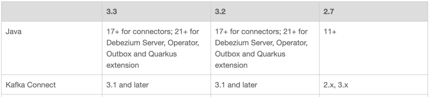

## 실습
---

- 실제 사례
  - https://techblog.uplus.co.kr/debezium%EC%9C%BC%EB%A1%9C-db-synchronization-%EA%B5%AC%EC%B6%95%ED%95%98%EA%B8%B0-1b6fba73010f
  - https://techblog.lycorp.co.jp/ko/migrating-large-data-with-kafka-and-etl => cdc 사용해서 DB 마이그레이션

```
성공적으로 발행된 ETL 메시지를 MongoDB에 저장할 때 긴 시간이 걸린다면 뒤에 이어지는 CDC 기반 마이그레이션 작업에서 처리할 메시지양이 많아집니다. 그렇게 되면 메시지 보관 기간이 길어지면서 Kafka 리소스를 더 많이 차지합니다. 또한 CDC 기반 마이그레이션 작업은 멱등성을 보장할 수 있도록 구성하긴 했지만 예상치 못한 상황이 발생할 수도 있기에 마이그레이션 시간이 늘어나는 것은 피하고자 했습니다.

따라서 최대한 빠르고 안전하게 메시지를 소비해 ETL 기반 마이그레이션을 완료해야 한다는 목표가 생겼습니다. 쿠버네티스의 리소스는 충분해서 처리량을 높이기 위해 토픽의 파티션을 늘리고 그에 맞게 파드를 실행할 수 있었는데요. 고민했던 점은 '어떻게 MongoDB가 이 높은 처리량을 감당할 수 있도록 만들까?'였습니다.

짧은 시간에 너무 많은 데이터가 삽입되면 복제가 설정된 DB에서는 복제 지연이 발생할 수 있고, 지연이 너무 길어지면 서비스 불가 상태가 될 수 있습니다. 따라서 복제 지연이 너무 커진다면 삽입 속도 조절을 고려해야 합니다.

ETL 이후부터 현재까지의 변경 사항을 MongoDB에 적용하려면 CDC 토픽에 들어온 MySQL CDC 메시지를 MongoDB에 반영하면 되는데 이때 언제부터의 메시지를 소비할 것인지를 정해야 합니다. 사실 ETL 데이터가 정확히 어느 시점의 데이터인지는 알 수 없으며, 시점을 정했을 때 오차가 발생할 확률도 높습니다. 따라서 우선 누락된 메시지를 없애기 위해 ETL을 내리는 시점 직전으로 MySQL CDC 오프셋을 조절했습니다.

이렇게 조치하면 누락된 메시지는 없을 테지만 이미 ETL 테이블에 반영된 메시지가 존재할 수 있는데요. 각 CDC 메시지는 멱등성이 보장된 데이터가 아니기에 중복 처리를 하면 문제가 발생합니다. 즉, 중복된 메시지는 다시 처리되지 않게 로직을 구현해야 합니다.
=> 이미지 테이블에 updatedDate라는 필드가 존재했기에 해당 필드를 사용해서 최신 메시지만 적용하도록 메시지를 판별하는 함수를 구현했습니다. 이로써 중복 메시지가 들어와도 최신 변경 사항만 적용할 수 있습니다.
=> fun isNewerMessage(message: Value): Boolean {
        val existingImage = imageRepository.findById(message.id)
        return existingImage.isEmpty || mapper.convertValue(message.updateDate.get(), OffsetDateTime::class.java).isAfter(existingImage.get().updatedDate)

Debezium MySQL Connector는 기본적으로 PK를 메시지의 키로 사용합니다. 따라서 파티션을 분배할 때 ID가 다르면 다른 파티션으로 분배될 수 있습니다.

메시지 처리 순서에 따라 결과가 달라지는 것을 막기 위해서는 CDC 메시지의 키를 변경해야 합니다. 동일한 의미를 갖는 데이터는 같은 파티션에 할당돼야 멱등성을 보장할 수 있습니다. 저희가 사용하고 있는 Debezium MySQL Connector에서는 message.key.columns라는 속성으로 키를 정의하는 방식을 변경할 수 있는데요. 이를 이용해 아래와 같이 동일한 의미의 메시지는 같은 파티션에 할당되도록 설정해서 CDC 메시지 처리의 멱등성을 보장했습니다.

"message.key.columns": "db_name.table_name:image_id,reference_id,reference_type"
```

=> 멱등성, 토픽/파티션, Kafka 리소스 부하, DB 부하, CDC 시점

- Kafka 설치 디렉토리 트리 구조 (메시지 브로커 + Connect 포함)

```
kafka_2.13-3.7.0/
├── bin/                              ← 실행 스크립트들
│   ├── kafka-server-start.sh          ← ✅ Kafka Broker (메시지 브로커) 실행
│   ├── kafka-server-stop.sh
│   ├── zookeeper-server-start.sh      ← ✅ ZooKeeper (메타데이터 관리, 일부 버전)
│   ├── kafka-topics.sh                ← 토픽 생성/조회
│   ├── kafka-console-producer.sh      ← CLI Producer
│   ├── kafka-console-consumer.sh      ← CLI Consumer
│   ├── kafka-connect-standalone.sh    ← ✅ Kafka Connect 단일 모드 실행
│   ├── kafka-connect-distributed.sh   ← ✅ Kafka Connect 분산 모드 실행
│   ├── kafka-producer-perf-test.sh
│   └── kafka-consumer-groups.sh
│
├── config/                           ← 설정 파일
│   ├── server.properties              ← ✅ Kafka Broker 설정 (log.dir, listeners 등)
│   ├── zookeeper.properties           ← ZooKeeper 설정
│   ├── connect-standalone.properties  ← Connect 단일 실행용 설정
│   ├── connect-distributed.properties ← Connect 클러스터용 설정
│   ├── producer.properties
│   └── consumer.properties
│
├── libs/                             ← Kafka 런타임 JAR 모음
│   ├── kafka-clients-*.jar           ← ✅ Kafka Producer/Consumer API
│   ├── kafka_2.13-*.jar              ← Kafka Broker 서버 코드
│   ├── connect-api-*.jar             ← ✅ Kafka Connect 프레임워크 API
│   ├── connect-runtime-*.jar         ← ✅ Kafka Connect 엔진 (커넥터 실행 환경)
│   ├── kafka-streams-*.jar
│   ├── slf4j-*.jar, log4j-*.jar      ← 로깅 관련
│   └── ...
│
├── plugins/                          ← (직접 생성) ✅ 커넥터 플러그인 설치 경로
│   ├── debezium-connector-mysql/
│   │   ├── debezium-connector-mysql-2.7.0.Final.jar
│   │   └── ...
│   └── kafka-connect-jdbc/
│       ├── kafka-connect-jdbc-10.7.4.jar
│       ├── mysql-connector-java-8.0.33.jar
│       └── ...
│
├── logs/
│   ├── server.log
│   ├── connect.log
│   └── zookeeper.log
│
└── LICENSE / NOTICE / README
```

brew install zookeeper
brew services start zookeeper


kafka-server-start /usr/local/etc/kafka/server.properties

kafka-topics --bootstrap-server localhost:9092 --list


curl -L -O https://repo1.maven.org/maven2/io/debezium/debezium-connector-mysql/2.7.0.Final/debezium-connector-mysql-2.7.0.Final-plugin.tar.gz


mkdir -p /usr/local/Cellar/kafka/4.1.0/libexec/plugins/debezium-mysql
cp -r debezium-connector-mysql/* /usr/local/Cellar/kafka/4.1.0/libexec/plugins/debezium-mysql/


connect-distributed /usr/local/etc/kafka/connect-distributed.properties
=> plugin.path=/usr/local/Cellar/kafka/4.1.0/libexec/plugins

```
curl -X POST http://localhost:8083/connectors \
  -H "Content-Type: application/json" \
  -d '{
    "name": "mysql-orders-connector",
    "config": {
      "connector.class": "io.debezium.connector.mysql.MySqlConnector",
      "database.hostname": "localhost",
      "database.port": "3306",
      "database.user": "root",
      "database.password": "",
      "database.server.id": "184054",
      "database.server.name": "mysql-cdc",
      "database.include.list": "ordersdb",
      "table.include.list": "ordersdb.orders",
      "include.schema.changes": "false",
      "database.history.kafka.bootstrap.servers": "localhost:9092",
      "database.history.kafka.topic": "schema-changes.orders"
    }
  }'
```
=> {"error_code":400,"message":"Connector configuration is invalid and contains the following 1 error(s):\nThe 'topic.prefix' value is invalid: A value is required\nYou can also find the above list of errors at the endpoint /connector-plugins/{connectorType}/config/validate"}%

```
curl -X POST http://localhost:8083/connectors \
  -H "Content-Type: application/json" \
  -d '{
  "name": "mysql-orders-connector",
  "config": {
    "connector.class": "io.debezium.connector.mysql.MySqlConnector",
    "database.hostname": "localhost",
    "database.port": "3306",
    "database.user": "root",
    "database.password": "",
    "database.server.id": "184054",
    "topic.prefix": "mysql-cdc",
    "database.include.list": "ordersdb",
    "table.include.list": "ordersdb.orders",
    "include.schema.changes": "false",
    "database.history.kafka.bootstrap.servers": "localhost:9092",
    "database.history.kafka.topic": "schema-changes.orders"
  }
}'
```

=> {"error_code":400,"message":"Connector configuration is invalid and contains the following 1 error(s):\nUnable to connect: The server time zone value 'KST' is unrecognized or represents more than one time zone. You must configure either the server or JDBC driver (via the 'connectionTimeZone' configuration property) to use a more specific time zone value if you want to utilize time zone support.\nYou can also find the above list of errors at the endpoint `/connector-plugins/{connectorType}/config/validate`"}%

```
curl -X POST http://localhost:8083/connectors \
  -H "Content-Type: application/json" \
  -d '{
  "name": "mysql-orders-connector",
  "config": {
    "connector.class": "io.debezium.connector.mysql.MySqlConnector",
    "database.hostname": "localhost",
    "database.port": "3306",
    "database.user": "root",
    "database.password": "",
    "database.server.id": "184054",
    "topic.prefix": "mysql-cdc",
    "database.include.list": "ordersdb",
    "table.include.list": "ordersdb.orders",
    "include.schema.changes": "false",
    "schema.history.internal.kafka.bootstrap.servers": "localhost:9092",
    "schema.history.internal.kafka.topic": "schema-changes.orders",
    "database.connectionTimeZone": "Asia/Seoul"
  }
}'
```

=> "database.history.kafka.bootstrap.servers": "localhost:9092",
"database.history.kafka.topic": "schema-changes.orders"
이 설정은 Debezium 1.x 시절 방식인데,
Debezium 2.x에서는 database.history.* → schema.history.internal.* 로 바뀌었습니다.

따라서 Debezium이 KafkaSchemaHistory 초기화에 실패해서 바로 터지는 것.


```
curl -X POST http://localhost:8083/connectors \
  -H "Content-Type: application/json" \
  -d '{
  "name": "mysql-orders-connector",
  "config": {
    "connector.class": "io.debezium.connector.mysql.MySqlConnector",
    "database.hostname": "localhost",
    "database.port": "3306",
    "database.user": "",
    "database.password": "",
    "database.server.id": "184054",
    "topic.prefix": "mysql-cdc",
    "database.include.list": "ordersdb",
    "table.include.list": "ordersdb.orders",
    "include.schema.changes": "false",
    "database.connectionTimeZone": "Asia/Seoul",

    "schema.history.internal.kafka.bootstrap.servers": "localhost:9092",
    "schema.history.internal.kafka.topic": "schema-changes.orders"
  }
}'
```

```
ERROR [mysql-orders-connector|task-0] WorkerSourceTask{id=mysql-orders-connector-0} Task threw an uncaught and unrecoverable exception. Task is being killed and will not recover until manually restarted (org.apache.kafka.connect.runtime.WorkerTask:251)
java.lang.NoSuchMethodError: 'org.apache.kafka.clients.consumer.ConsumerRecords org.apache.kafka.clients.consumer.KafkaConsumer.poll(long)'
	at io.debezium.storage.kafka.history.KafkaSchemaHistory.recoverRecords(KafkaSchemaHistory.java:319) ~[debezium-storage-kafka-2.7.0.Final.jar:2.7.0.Final]
	at io.debezium.relational.history.AbstractSchemaHistory.recover(AbstractSchemaHistory.java:100) ~[debezium-core-2.7.0.Final.jar:2.7.0.Final]
	at io.debezium.relational.history.SchemaHistory.recover(SchemaHistory.java:192) ~[debezium-core-2.7.0.Final.jar:2.7.0.Final]
	at io.debezium.relational.HistorizedRelationalDatabaseSchema.recover(HistorizedRelationalDatabaseSchema.java:72) ~[debezium-core-2.7.0.Final.jar:2.7.0.Final]
	at io.debezium.schema.HistorizedDatabaseSchema.recover(HistorizedDatabaseSchema.java:40) ~[debezium-core-2.7.0.Final.jar:2.7.0.Final]
	at io.debezium.connector.common.BaseSourceTask.validateAndLoadSchemaHistory(BaseSourceTask.java:148) ~[debezium-core-2.7.0.Final.jar:2.7.0.Final]
	at io.debezium.connector.mysql.MySqlConnectorTask.start(MySqlConnectorTask.java:134) ~[debezium-connector-mysql-2.7.0.Final.jar:2.7.0.Final]
	at io.debezium.connector.common.BaseSourceTask.start(BaseSourceTask.java:248) ~[debezium-core-2.7.0.Final.jar:2.7.0.Final]
	at org.apache.kafka.connect.runtime.AbstractWorkerSourceTask.initializeAndStart(AbstractWorkerSourceTask.java:288) ~[connect-runtime-4.1.0.jar:?]
	at org.apache.kafka.connect.runtime.WorkerTask.doStart(WorkerTask.java:191) ~[connect-runtime-4.1.0.jar:?]
	at org.apache.kafka.connect.runtime.WorkerTask.doRun(WorkerTask.java:242) ~[connect-runtime-4.1.0.jar:?]
	at org.apache.kafka.connect.runtime.WorkerTask.run(WorkerTask.java:298) ~[connect-runtime-4.1.0.jar:?]
	at org.apache.kafka.connect.runtime.AbstractWorkerSourceTask.run(AbstractWorkerSourceTask.java:83) ~[connect-runtime-4.1.0.jar:?]
	at org.apache.kafka.connect.runtime.isolation.Plugins.lambda$withClassLoader$1(Plugins.java:254) ~[connect-runtime-4.1.0.jar:?]
	at java.base/java.util.concurrent.Executors$RunnableAdapter.call(Executors.java:572) ~[?:?]
	at java.base/java.util.concurrent.FutureTask.run(FutureTask.java:317) ~[?:?]
	at java.base/java.util.concurrent.ThreadPoolExecutor.runWorker(ThreadPoolExecutor.java:1144) ~[?:?]
	at java.base/java.util.concurrent.ThreadPoolExecutor$Worker.run(ThreadPoolExecutor.java:642) ~[?:?]
	at java.base/java.lang.Thread.run(Thread.java:1583) [?:?]
[2025-10-19 22:42:30,693] INFO [mysql-orders-connector|task-0] Stopping down connector (io.debezium.connector.common.BaseSourceTask:406)
```

=> kafka-connect, debezium 간의 버전 호환성 필요


=> https://debezium.io/releases/

### 실행

```
0. brew services start zookeeper

1. kafka-server-start /usr/local/etc/kafka/server.properties
=> 토픽 목록 보기 : kafka-topics --bootstrap-server localhost:9092 --list

2. connect-distributed /usr/local/etc/kafka/connect-distributed.properties

3.

curl -X POST http://localhost:8083/connectors \
  -H "Content-Type: application/json" \
  -d '{
  "name": "mysql-orders-connector",
  "config": {
    "connector.class": "io.debezium.connector.mysql.MySqlConnector",
    "database.hostname": "localhost",
    "database.port": "3306",
    "database.user": "root",
    "database.password": "",
    "database.server.id": "184054",
    "topic.prefix": "mysql-cdc",
    "database.include.list": "ordersdb",
    "table.include.list": "ordersdb.orders",
    "include.schema.changes": "false",
    "database.connectionTimeZone": "Asia/Seoul",

    "schema.history.internal.kafka.bootstrap.servers": "localhost:9092",
    "schema.history.internal.kafka.topic": "schema-changes.orders"
  }
}'
```

- debezium-connector-mysql 디렉토리

```
CHANGELOG.md
CONTRIBUTE.md
COPYRIGHT.txt
LICENSE-3rd-PARTIES.txt
LICENSE.txt
README.md
README_JA.md
README_KO.md
README_ZH.md
antlr4-runtime-4.10.1.jar
debezium-api-3.2.4.Final.jar
debezium-common-3.2.4.Final.jar
debezium-connector-binlog-3.2.4.Final.jar
debezium-connector-mysql-3.2.4.Final.jar
debezium-core-3.2.4.Final.jar
debezium-ddl-parser-3.2.4.Final.jar
debezium-openlineage-api-3.2.4.Final.jar
debezium-storage-file-3.2.4.Final.jar
debezium-storage-kafka-3.2.4.Final.jar
mysql-binlog-connector-java-0.40.2.jar
mysql-connector-j-9.1.0.jar
```

## 변경 감지 이벤트 형태
---

```java
@Component
public class OrderConsumer {

    @KafkaListener(topics = "mysql-cdc.ordersdb.orders", groupId = "cdc-group")
    public void consume(ConsumerRecord<String, String> record) {
        String key = record.key();
        String value = record.value();

        System.out.println("---- CDC Event ----");
        System.out.println("Key: " + key);
        System.out.println("Value: " + value);
        System.out.println("-------------------");
    }

}
```

- Key, Value 둘 다 아래와 같은 포맷

```json
{
  "schema" : {
    ...
  },
  "payload" : {
    ...
  }
}
```

**insert**

- Key

```json
{
  "schema" : {
    "type" : "struct",
    "fields" : [ {
      "type" : "int64",
      "optional" : false,
      "field" : "id"
    } ],
    "optional" : false,
    "name" : "mysql-cdc.ordersdb.orders.Key"
  },
  "payload" : {
    "id" : 13
  }
}
```

- Value

```json
{
  "schema" : {
    "type" : "struct",
    "fields" : [ {
      "type" : "struct",
      "fields" : [ {
        "type" : "int64",
        "optional" : false,
        "field" : "id"
      }, {
        "type" : "string",
        "optional" : true,
        "field" : "customer_name"
      }, {
        "type" : "bytes",
        "optional" : true,
        "name" : "org.apache.kafka.connect.data.Decimal",
        "version" : 1,
        "parameters" : {
          "scale" : "2",
          "connect.decimal.precision" : "10"
        },
        "field" : "amount"
      }, {
        "type" : "string",
        "optional" : true,
        "name" : "io.debezium.time.ZonedTimestamp",
        "version" : 1,
        "field" : "created_at"
      } ],
      "optional" : true,
      "name" : "mysql-cdc.ordersdb.orders.Value",
      "field" : "before"
    }, {
      "type" : "struct",
      "fields" : [ {
        "type" : "int64",
        "optional" : false,
        "field" : "id"
      }, {
        "type" : "string",
        "optional" : true,
        "field" : "customer_name"
      }, {
        "type" : "bytes",
        "optional" : true,
        "name" : "org.apache.kafka.connect.data.Decimal",
        "version" : 1,
        "parameters" : {
          "scale" : "2",
          "connect.decimal.precision" : "10"
        },
        "field" : "amount"
      }, {
        "type" : "string",
        "optional" : true,
        "name" : "io.debezium.time.ZonedTimestamp",
        "version" : 1,
        "field" : "created_at"
      } ],
      "optional" : true,
      "name" : "mysql-cdc.ordersdb.orders.Value",
      "field" : "after"
    }, {
      "type" : "struct",
      "fields" : [ {
        "type" : "string",
        "optional" : false,
        "field" : "version"
      }, {
        "type" : "string",
        "optional" : false,
        "field" : "connector"
      }, {
        "type" : "string",
        "optional" : false,
        "field" : "name"
      }, {
        "type" : "int64",
        "optional" : false,
        "field" : "ts_ms"
      }, {
        "type" : "string",
        "optional" : true,
        "name" : "io.debezium.data.Enum",
        "version" : 1,
        "parameters" : {
          "allowed" : "true,first,first_in_data_collection,last_in_data_collection,last,false,incremental"
        },
        "default" : "false",
        "field" : "snapshot"
      }, {
        "type" : "string",
        "optional" : false,
        "field" : "db"
      }, {
        "type" : "string",
        "optional" : true,
        "field" : "sequence"
      }, {
        "type" : "int64",
        "optional" : true,
        "field" : "ts_us"
      }, {
        "type" : "int64",
        "optional" : true,
        "field" : "ts_ns"
      }, {
        "type" : "string",
        "optional" : true,
        "field" : "table"
      }, {
        "type" : "int64",
        "optional" : false,
        "field" : "server_id"
      }, {
        "type" : "string",
        "optional" : true,
        "field" : "gtid"
      }, {
        "type" : "string",
        "optional" : false,
        "field" : "file"
      }, {
        "type" : "int64",
        "optional" : false,
        "field" : "pos"
      }, {
        "type" : "int32",
        "optional" : false,
        "field" : "row"
      }, {
        "type" : "int64",
        "optional" : true,
        "field" : "thread"
      }, {
        "type" : "string",
        "optional" : true,
        "field" : "query"
      } ],
      "optional" : false,
      "name" : "io.debezium.connector.mysql.Source",
      "version" : 1,
      "field" : "source"
    }, {
      "type" : "struct",
      "fields" : [ {
        "type" : "string",
        "optional" : false,
        "field" : "id"
      }, {
        "type" : "int64",
        "optional" : false,
        "field" : "total_order"
      }, {
        "type" : "int64",
        "optional" : false,
        "field" : "data_collection_order"
      } ],
      "optional" : true,
      "name" : "event.block",
      "version" : 1,
      "field" : "transaction"
    }, {
      "type" : "string",
      "optional" : false,
      "field" : "op"
    }, {
      "type" : "int64",
      "optional" : true,
      "field" : "ts_ms"
    }, {
      "type" : "int64",
      "optional" : true,
      "field" : "ts_us"
    }, {
      "type" : "int64",
      "optional" : true,
      "field" : "ts_ns"
    } ],
    "optional" : false,
    "name" : "mysql-cdc.ordersdb.orders.Envelope",
    "version" : 2
  },
  "payload" : {
    "before" : null,
    "after" : {
      "id" : 13,
      "customer_name" : "LEE66",
      "amount" : "Opg=",
      "created_at" : "2025-10-20T14:34:09Z"
    },
    "source" : {
      "version" : "3.2.4.Final",
      "connector" : "mysql",
      "name" : "mysql-cdc",
      "ts_ms" : 1760970849000,
      "snapshot" : "false",
      "db" : "ordersdb",
      "sequence" : null,
      "ts_us" : 1760970849000000,
      "ts_ns" : 1760970849000000000,
      "table" : "orders",
      "server_id" : 1,
      "gtid" : null,
      "file" : "binlog.000040",
      "pos" : 203734562,
      "row" : 0,
      "thread" : 411,
      "query" : null
    },
    "transaction" : null,
    "op" : "c",
    "ts_ms" : 1760970849105,
    "ts_us" : 1760970849105848,
    "ts_ns" : 1760970849105848000
  }
}
```

- update : update 수만큼 이벤트 옴

```json
{
  "schema" : {
    ...
  },
  "payload" : {
    "before" : {
      "id" : 8,
      "customer_name" : "LEE22",
      "amount" : "LuA=",
      "created_at" : "2025-10-19T13:40:52Z"
    },
    "after" : {
      "id" : 8,
      "customer_name" : "MOD_LEE22",
      "amount" : "LuA=",
      "created_at" : "2025-10-19T13:40:52Z"
    },
    "source" : {
      "version" : "3.2.4.Final",
      "connector" : "mysql",
      "name" : "mysql-cdc",
      "ts_ms" : 1760885949000,
      "snapshot" : "false",
      "db" : "ordersdb",
      "sequence" : null,
      "ts_us" : 1760885949000000,
      "ts_ns" : 1760885949000000000,
      "table" : "orders",
      "server_id" : 1,
      "gtid" : null,
      "file" : "binlog.000040",
      "pos" : 203733180,
      "row" : 0,
      "thread" : 411,
      "query" : null
    },
    "transaction" : null,
    "op" : "u",
    "ts_ms" : 1760885949152,
    "ts_us" : 1760885949152329,
    "ts_ns" : 1760885949152329000
  }
}
```

```json
{
  "schema" : {
    ...
  },
  "payload" : {
    "before" : {
      "id" : 9,
      "customer_name" : "LEE22",
      "amount" : "LuA=",
      "created_at" : "2025-10-19T14:46:20Z"
    },
    "after" : {
      "id" : 9,
      "customer_name" : "MOD_LEE22",
      "amount" : "LuA=",
      "created_at" : "2025-10-19T14:46:20Z"
    },
    "source" : {
      "version" : "3.2.4.Final",
      "connector" : "mysql",
      "name" : "mysql-cdc",
      "ts_ms" : 1760885949000,
      "snapshot" : "false",
      "db" : "ordersdb",
      "sequence" : null,
      "ts_us" : 1760885949000000,
      "ts_ns" : 1760885949000000000,
      "table" : "orders",
      "server_id" : 1,
      "gtid" : null,
      "file" : "binlog.000040",
      "pos" : 203733180,
      "row" : 1,
      "thread" : 411,
      "query" : null
    },
    "transaction" : null,
    "op" : "u",
    "ts_ms" : 1760885949152,
    "ts_us" : 1760885949152769,
    "ts_ns" : 1760885949152769000
  }
}
```

- delete

```json
{
  "schema" : {
    ...
  },
  "payload" : {
    "before" : {
      "id" : 10,
      "customer_name" : "MOD_LEE",
      "amount" : "LuA=",
      "created_at" : "2025-10-19T14:54:39Z"
    },
    "after" : null,
    "source" : {
      "version" : "3.2.4.Final",
      "connector" : "mysql",
      "name" : "mysql-cdc",
      "ts_ms" : 1760886160000,
      "snapshot" : "false",
      "db" : "ordersdb",
      "sequence" : null,
      "ts_us" : 1760886160000000,
      "ts_ns" : 1760886160000000000,
      "table" : "orders",
      "server_id" : 1,
      "gtid" : null,
      "file" : "binlog.000040",
      "pos" : 203733582,
      "row" : 0,
      "thread" : 411,
      "query" : null
    },
    "transaction" : null,
    "op" : "d",
    "ts_ms" : 1760886160859,
    "ts_us" : 1760886160859853,
    "ts_ns" : 1760886160859853000
  }
}
```

- `payload.op`에 Create(c), Update(u), Delete(d) 나와있음

### 동시성 ?
- 동일한 테이블에 대한 이벤트는 순서대로 처리돼야한다.
- 여러 컨슈머에서 동일한 테이블 이벤트를 처리하면 안되지않을까 ??
- 그럼 컨슈머 구성을 어떻게하는게 좋을까

## 실전 시나리오
---
> db 마이그레이션에서 서비스 중단 시간을 최소화하는거야, 예를 들어 mysql -> oracle로 이관한다고 했을때 특정 시점의 스냅샷 데이터를 mysql -> oracle로 이관하고, 이관되는 동안 mysql에 commit된 내역들은 CDC로 수집하는거지. 그리고 스냅샷 이관이 완료되면, 이관되는 동안 commit된 내역에 대한 이벤트들을 oracle에 반영하는거야. 그래서, 쌓인 이벤트들을 최대한 빠르게 Oracle DB에 반영하게 하고싶은거지.(대신 Oracle DB에 큰 부하는 주지 않으면서) 그럼 파티션 개수, 컨슈머 그룹 구성을 어떻게 하는게 좋을것 같아 ? 내 생각엔 티션 : 컨슈머 수 = 1:1 -> 2:2 -> 이런식으로 늘려가면서 최적의 개수를 찾는게 좋지 않나 생각이드는데, 그리고 Oracle db 이상있으면 잠깐 이벤트 cosume을 멈추는? 그런것도 가능한가 ?

- 즉, 주요 목표는:
  - **서비스 중단 없이(또는 최소로)** DB 마이그레이션 (Zero Downtime DB Migration)
  - 마이그레이션 동안 쌓인 DML 이벤트를 **최대한 빠르게 target db에 반영**


### 정확히 원하는 시점의 이벤트부터 쌓는게 가능할까 ?

| 시각       | 액션             | 비고 |
|----------|-----------| ---- |
| 03:59:57 | Cubrid commit  | |
| 03:59:58 | Cubrid commit  | |
| 03:59:59 | Cubrid commit  | |
| 04:00:00 | 이 시점의 스냅샷을 기준으로 MySQL로 데이터 마이그레이션 | |
| 04:00:01 | Cubrid commit | Kafka Connect에서 감지해서 이벤트 발행 |

- 즉, 정확히 스냅샷 이후 커밋부터(04:00:01) 카프카 큐에 적재하는게 가능한가 ?

### 완전한 무중단 마이그레이션이 가능할까 ?
> '스냅샷 마이그레이션 -> cdc 이벤트 target db에 동기화' 하더라도 mysql cdc 이벤트가 계속 발생하는한 완전하게 두 db가 일치된 상태인 경우는 없을것 같은데

현실적인 목표는 “Near-Zero Downtime”  보통 이런 식으로 접근합니다

| 단계                         | 설명                                                  |
| -------------------------- | --------------------------------------------------- |
| **1️⃣ Snapshot Migration** | MySQL 데이터를 Oracle로 bulk dump/import (대부분 Read-only) |
| **2️⃣ CDC 동기화 시작**         | Debezium이 MySQL 변경 이벤트를 Oracle에 실시간 반영              |
| **3️⃣ 동기화 상태 확인**          | Kafka Lag이 거의 0일 때 → Oracle과 MySQL이 거의 일치           |
| **4️⃣ 서비스 Freeze (잠깐)**    | MySQL 쓰기 중단 or Lock (수초~수분)                         |
| **5️⃣ 잔여 CDC 이벤트 반영**      | 남은 이벤트 전부 Oracle에 적용                                |
| **6️⃣ 서비스 DB 전환**          | 애플리케이션 DB URL → Oracle 로 변경                         |
| **7️⃣ Oracle 쓰기 재개**       | Oracle에서 서비스 정상 운영                                  |


※ 개인적으로 생각해본 zero downtime
- 애플리케이션 인스턴스 3개라고 가정
- 1개만 먼저 Oracle로 붙임 (1: oracle, 2,3 : mysql)
- oracle -> mysql도 cdc 구성
- 1번 인스턴스는 oracle에 커밋하게됨 - cdc 흐름 : oracle -> mysql --이미 처리된건지 확인하고 반영하지 않음--> oracle
- 2,3번 인스턴스는 mysql에 커밋하게됨 - cdc 흐름 : mysql -> oracle --이미 처리된건지 확인하고 반영하지 않음--> mysql
- 2,3번도 순차적으로 oracle로 붙음

=> 이론적으로 완전 무중단 DB 전환이 가능한 이상적 설계예요. 다만 실무에서는 루프 방지 / 충돌 해결 / idempotent 처리 를 완벽히 구현해야 해서,
Debezium 단독으론 어렵고 중간에 custom filtering layer가 꼭 필요합니다.


⚠️ (1) 루프(Loop) 방지 문제

가장 치명적이에요.

MySQL -> Oracle (CDC)
Oracle -> MySQL (CDC)


이벤트가 round-trip으로 계속 도는 무한 루프가 발생할 수 있어요.
그래서 변경 출처(source) 를 구분해야 합니다.

예:

Debezium event header에 "source.system": "mysql"

Oracle connector가 이걸 감지해서 “자기 자신이 만든 변경”은 무시

Debezium의 source 필드나 transaction.id를 활용하거나,
CDC 이벤트에 origin tag 를 붙여야 해요.

{
"op": "u",
"source": {
"db": "oracle",
"instance": "app-instance-1"
},
"after": { "id": 100, "status": "SHIPPED" }
}


Consumer는 이걸 보고
“이미 Oracle→MySQL에서 발생한 이벤트면 다시 반영하지 않음”
하는 로직을 넣어야 합니다.

⚠️ (2) Primary Key 충돌 / Conflict 해결

양방향 쓰기에서 같은 row를 양쪽에서 수정하면 충돌 납니다.

예:

app1 (Oracle) → status = "paid"

app2 (MySQL) → status = "cancelled"

CDC가 교차 반영하면 마지막 commit이 이깁니다.
즉, 최종 일관성(eventual consistency) 이고
동시 수정 충돌(conflict resolution) 정책을 명시해야 합니다.

보통 3가지 전략 중 하나를 선택해요:

정책	설명
Last Write Wins (기본)	타임스탬프 최신 변경이 승자
Source Priority	Oracle > MySQL 같은 우선순위 부여
Custom Merge	컬럼별 머지 로직 적용 (예: 재고량 합산 등)
⚠️ (3) 트랜잭션 순서 유지 (순서 불일치 문제)

Oracle CDC와 MySQL CDC는 commit 타이밍이 다르기 때문에
서로 반영 순서가 달라질 수 있습니다.

이건 Kafka partition key 를 PK 기반으로 고정하고
Debezium의 transaction.id 를 활용하면 상당 부분 완화됩니다.

⚠️ (4) Idempotent 처리

중복 이벤트가 들어오더라도 안전하게 무시할 수 있게 해야 합니다.

방법:

Oracle/MySQL 쿼리에서 upsert(MERGE INTO, INSERT ... ON DUPLICATE KEY UPDATE) 사용

CDC consumer는 “변경된 컬럼이 실제로 다를 때만 update” 수행

⚠️ (5) 스키마 차이 문제

MySQL ↔ Oracle 간엔

데이터 타입 차이 (VARCHAR vs NVARCHAR, DATETIME vs TIMESTAMP)

AUTO_INCREMENT vs SEQUENCE

NULL/DEFAULT 처리 차이
이 존재하기 때문에 CDC 이벤트 매핑 시 변환 레이어가 필요합니다.

### 토픽
- Debezium은 `<topic.prefix>.<database>.<table>` 조합으로 토픽을 자동 생성
- 예시:
```
"topic.prefix": "mysql-cdc",
"database.include.list": "ordersdb,usersdb",
"table.include.list": "ordersdb.orders,ordersdb.payments,usersdb.user_profiles"
```
=> 토픽 : `mysql-cdc.ordersdb.orders`, `mysql-cdc.ordersdb.payments`, `mysql-cdc.usersdb.user_profiles`

- 스냅샷 데이터 마이그레이션이 완전 끝나고 이벤트 consume을 시작하는게 아닌, 마이그레이션이 끝난 테이블 (토픽)은 먼저 consume하는건 ?
=> Sink Connector 여러 개로 분리
=> Spring Boot Application이면 ?

### 파티션 / 컨슈머 그룹
- 그래서 Debezium이 새 토픽으로 이벤트를 publish하면, Kafka 브로커가 내부 설정값을 기준으로 자동 생성합니다.
- Kafka에는 자동 생성 토픽의 구성을 제어하는 설정들이 있습니다:

| 설정 항목                        | 설명                               | 기본값    |
| ---------------------------- | -------------------------------- | ------ |
| `auto.create.topics.enable`  | 존재하지 않는 토픽으로 publish할 때 자동 생성 여부 | `true` |
| `num.partitions`             | 자동 생성되는 토픽의 기본 파티션 수             | `1`    |
| `default.replication.factor` | 자동 생성되는 토픽의 복제본 개수               | `1`    |

- Debezium 입장에서는 “토픽을 지정”할 뿐, Kafka가 어떤 설정으로 토픽을 생성할지는 브로커 설정에 위임

### 파티션 수 변경 방법

**브로커 설정 변경 (글로벌 기본값)**
> Kafka 전체 기본값을 바꿔서 자동 생성 토픽의 파티션 수를 조정할 수 있습니다.

```
# server.properties
num.partitions=4
default.replication.factor=3
```

**토픽 생성 스크립트 실행**

```
kafka-topics.sh --create \
  --topic mysql-cdc.ordersdb.orders \
  --partitions 4 \
  --replication-factor 3 \
  --bootstrap-server localhost:9092
```

**자동 생성 끄고, 명시적으로 관리**
> 운영 환경에서는 보통 이렇게 합니다

```
auto.create.topics.enable=false
```

### Target DB에서 받을 부하 ?
> 순식간에 커밋이 많이 발생하면 ?? 근데 서비스중인 DB가 아니니까 괜찮지 않나 ?

- 부하 조절 방법 ?

“서비스 중이 아니라면 부하 자체는 덜 민감하지만”,
DB 자체의 트랜잭션 처리 구조나 리소스 관리 한계 때문에
한꺼번에 커밋이 몰리면 실제로는 심각한 성능 저하나 병목이 생깁니다.

| 병목 요소                      | 증상                              |
| -------------------------- | ------------------------------- |
| **Redo Log flush**         | 디스크 I/O 병목 (commit latency 급상승) |
| **Undo space 부족**          | ORA-30036 / rollback segment 확장 |
| **Row-level lock 경합**      | PK 중복 update 시 lock 대기          |
| **Buffer cache thrashing** | 대량 DML 시 cache hit ratio 저하     |
| **Index maintenance 부하**   | 인덱스 재정렬로 CPU 폭증                 |


그래서 실무에서는 “CDC 배치 제어”를 둡니다

CDC consumer (예: Spring Boot 애플리케이션) 또는 Sink Connector 쪽에서
DB 반영 속도를 인위적으로 제어합니다.

| 전략                            | 설명                               |
| ----------------------------- | -------------------------------- |
| **① 배치 크기 제한 (Batch Size)**   | 500건, 1000건 단위로 모아 커밋            |
| **② 지연 주입 (Throttle)**        | 커밋 사이에 짧은 sleep(수 ms~수십ms)       |
| **③ 병렬 제한 (Thread Pool)**     | DB insert 스레드 수 제한 (예: 2~4개)     |
| **④ 트랜잭션 크기 조절**              | auto-commit 대신 명시적 commit으로 조절   |
| **⑤ DLQ (Dead Letter Queue)** | DB 오류나 constraint 위반 시 재처리용 큐 분리 |


### 장애 시나리오
- Target DB 장애시
- 이벤트 유실
  - connect <--> kafka
  - kafka <--> consumer

- consumer : sync connector vs spring boot application

-----


- Kafka is run as a cluster of one or more servers ?
- TCP 네트워크로 통신

- 토픽은, 파일 시스템에 비유하면, '폴더' 같은것
- 이벤트는, 폴더 안의 파일
- 이벤트는 원하는 기간동안 저장될 수 있다.
- 같은 키를 갖는 이벤트는, 토픽 내의 동일한 파티션에 append 된다.
- 특정 토픽의 파티션을 컨슈머가 읽을 때, 이벤트가 write된 순서대로 읽는 것을 보장한다.
- 내결함성을 위해 토픽은 보통 복제본을 관리한다. => 3 브로커 ??


https://docs.confluent.io/kafka/design/consumer-design.html

[컨슈머]
- fetch request를 kafka broker에게 보낸다.
- request에 offset을 지정하고, 그 offset부터 시작하는 chunk log(?)를 수신받는다.
- kafka consumer는 pull-based design
  - consumer 상황에 맞게 이벤트를 처리할 수 있다.

[컨슈머 그룹]
> A consumer group is a single logical consumer implemented with multiple physical consumers "for reasons of throughput and resilience." (https://docs.confluent.io/_glossary.html#term-consumer-group)

- Kafka에서 데이터를 읽는 단위는 “Consumer”, 그 Consumer 여러 개를 하나의 Group ID로 묶은 것이 Consumer Group입니다.
- 모든 Consumer는 반드시 어떤 Group에 속해야 합니다.
- Kafka는 “하나의 파티션은 동시에 오직 하나의 Consumer만 읽을 수 있다.”(단, 서로 다른 그룹이면 상관없음)
  - Each partition is consumed by exactly one consumer within each consumer group at any given time.
- Kafka Broker가 자동으로 파티션을 그룹 내 Consumer들에게 분배(assign) 합니다. 이를 Consumer Rebalance 라고 부릅니다.
- Kafka Broker 측에서는, Group coordinator가 컨슈머 그룹 내의 컨슈머들에게 적절하게 부하를 나눠주는 등의 역할을 한다.

★ hot partition 이슈 ?
=> 예를 들어, CDC에서 파티션을 PK값을 기준으로 나눴는데, 특정 PK를 가진 데이터에 DML 요청이 너무 많으면 ? (인스타그램 인플루언서 같은 ?)

컨슈머 수 ≤ 파티션 수 로 유지
→ 가장 일반적인 권장 설정입니다.

rebalance ?

[파티션]
- 각 파티션은 서로 다른 서버에 분산될 수 있는데, 이러한 특징 때문에 하나의 토픽이 여러 서버에 걸쳐 수평적으로 확장될 수 있다.

============
Kafka Producer의 파티션 결정 로직은 아주 단순합니다:

partition = hash(key) % number_of_partitions


즉, 메시지에 key가 있으면 그 key를 해시해서 파티션을 고르고,
key가 없으면 라운드로빈(round robin) 으로 랜덤 배정됩니다.
Debezium은 Kafka Producer를 내부적으로 사용하므로, 이 같은 파티셔닝 규칙을 그대로 따릅니다.

[토픽별 파티션 개수 정하기]
> 목표 : 쌓인 이벤트가 최대한 빠르게 DB에 반영될 수 있도록 (DB 부하 높으면 뻗나 ??)

- 실험
  => 새벽시간대에 cdc로 수집해보고 처리해보면서 조절 ?? (파티션 : 인스턴스 수 = 1:1 -> 2:2 -> ... 조절해가면서)
  => 그럼 하루에 한번만 실험 가능한거 아닌가 ??
  => 실제 쌓인 이벤트 기반으로 계속 조절해가면서 실험할 수 있나 ??
  => 인스턴스 수 조절해가면서

- 컨슈머 그룹에서 이벤트 소비 속도(?) 조절 가능한가 ?

================

실전 개수 구성

- 브로커 수 / 파티션 수 / 컨슈머 수 등등

===============

다른 기술들(Rabbit MQ 등)과의 차별점 ?

물론 하나의 메시지가 발행될 때, 단 하나의 실행만 이루어져야 하는 요구사항에서는 카프카를 활용하는 것보다는 메시지 큐를 활용하는 것이 목적에 더 맞는 구조라고 볼 수도 있다. 경쟁하는 소비자 패턴(Competing Consumers Pattern) 을 예시로 든다면, 해당 패턴은 여러 개의 메시지를 빠르게 처리해야 할 때 컨슈머의 수를 늘려서 각각의 메시지 소비 속도를 늘리는 것을 말하는데, 이 때에는 특정 컨슈머가 읽은 메시지는 다른 컨슈머가 읽을 수 없도록 명확하게 소비되어야 한다. 그리고 그러한 상황에서는 카프카를 통한 로직 처리보다는 메시지 큐를 활용하는게 맞다.

[리밸런싱]
- 만일 컨슈머에서 장애가 발생하거나 새로운 컨슈머가 컨슈머 그룹에 추가될 때에는 리밸런싱이 발생하고, 리밸런싱 이후에는 각 컨슈머에게 할당되는 파티션이 바뀔 수도 있게 된다. 이 때 각각의 컨슈머는 각 파티션의 Committed Offset 부터 메시지를 읽어들이게 된다. (Consumed Offset 이 아니라 Committed Offset 이다) 바로 이 구간에서 중복 메시지 이슈가 발생할 수 있다.
- 카프카를 활용한 비즈니스 구현에서는 Committed Offset 이후의 메시지 구간에서 중복 메시징 이슈가 발생할 수 있다는 것을 전제로 두고, 컨슈머가 이러한 상황을 스스로 해결해야 함을 인지하는 것이 중요하다.

중복 처리 방지를 어떻게 할 것인가

- stop the world, 카프카 2.3 버전부터 도입된 Incremental Cooperative Rebalancing

### kafka connect에 debezium-mysql-connector를 사용할때, mysql binlog의 변경 사항이 있는지는 polling방식으로 계속 확인하는거야 ?
> Debezium MySQL Connector는 내부적으로 MySQL의 replication protocol(MySQL 서버와 Replica(슬레이브) 간의 TCP 기반 통신 프로토콜)을 그대로 사용합니다.
> 즉, MySQL 슬레이브(Replica) 처럼 동작합니다.

```
        (TCP connection)
MySQL  <---------------->  Debezium MySQL Connector
  ↑                            │
  │                            │
  └── binlog events (push) ───▶ │
```

- Debezium MySQL Connector → MySQL 서버 간 통신은 다음 순서로 이루어진다:

| 순서 | 동작                  | 설명                                                |
| -- | ------------------- | ------------------------------------------------- |
| ①  | TCP 연결 생성           | MySQL의 3306 포트로 TCP 접속 (`handshake`)              |
| ②  | 인증 (Handshake)      | replication 계정(`REPLICATION SLAVE` 권한)으로 로그인      |
| ③  | Replication 등록      | `COM_REGISTER_SLAVE` 명령 전송                        |
| ④  | Binlog Streaming 요청 | `COM_BINLOG_DUMP` 또는 `COM_BINLOG_DUMP_GTID` 명령 송신 |
| ⑤  | 이벤트 수신 (Push)       | MySQL이 binlog 이벤트를 TCP 스트림으로 Debezium에 **push**   |
| ⑥  | Debezium 처리         | Debezium이 이벤트를 파싱 → Kafka로 publish                |


- MySQL이 replication 프로토콜을 통해 binlog를 “보내주긴 하지만”, 그건 consumer가 먼저 요청한 결과로 열려 있는 스트림을 유지하는 형태입니다.
- 그래서 완전한 push라기보단 “persistent pull stream”이라고 보는 게 정확합니다.

| 구분         | 역할                 | 주체                      | 네트워크 방향                      |
| ---------- | ------------------ | ----------------------- | ---------------------------- |
| 트리거 기반 CDC | 테이블 변경 시 이벤트 직접 실행 | MySQL                   | 내부(쿼리 실행)                    |
| 로그 기반 CDC  | binlog 이벤트를 읽음     | **CDC Consumer (pull)** | MySQL → Consumer (streaming) |


**MySQL binlog CDC의 기본 구조**
- MySQL은 트랜잭션 커밋 시 변경 내용을 binary log (binlog) 파일에 기록합니다.
- 이후 replica(혹은 CDC consumer) 가 master(MySQL 서버)에 replication 프로토콜을 통해 접속해서,
binlog의 변경 이벤트를 streaming 방식으로 수신(pull) 합니다.
- Replica(혹은 Debezium, Maxwell, Kafka Connect 같은 CDC 도구)가 COM_BINLOG_DUMP 명령을 MySQL 서버에 보냄
- MySQL은 해당 위치부터 새로운 binlog 이벤트를 지속적으로 전송(stream)
- Replica는 이를 받아서 파싱 후 Kafka 등으로 전달
- 즉, MySQL 서버 입장에서는 클라이언트 요청에 대한 지속적인 응답 스트림을 보내는 형태로, 외형상 “push”처럼 보이지만 연결 주도권은 consumer(=pull) 에 있습니다.

**왜 “log-based CDC가 효율적”인가?**
- CDC 도구가 binlog를 읽을 뿐, 실제 테이블이나 애플리케이션 쿼리에는 관여하지 않습니다.
- 즉, 트리거나 추가 SELECT 쿼리가 없고, 데이터 변경 시점에 MySQL이 이미 생성한 로그를 재활용하기 때문에,
- 원본 DB의 부하를 거의 증가시키지 않습니다.
- 그래서 “로그 기반 CDC가 원본 시스템의 성능에 영향을 최소화한다”는 설명이 성립합니다.

## 참고 자료
---
- [https://debezium.io/documentation/reference/3.2/](https://debezium.io/documentation/reference/3.2//)
