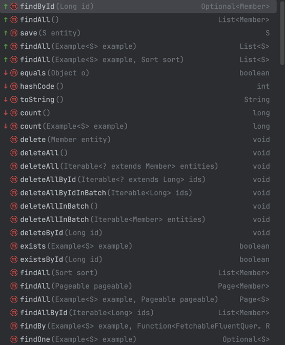

> 최종목표 : jpa 정산 적용하면 어떤느낌일지, 적절할지 등..에 대한 생각정리

## JPA (Java Persistence API)
---
> 표준 명세 (Specification)

- 역할: 자바 객체를 관계형 데이터베이스 테이블과 매핑하기 위한 표준 인터페이스.
- 즉: “규칙서” 역할을 합니다.
- JPA 자체로 실행 가능한 코드는 거의 없고, 이를 구현한 ORM 프레임워크가 필요합니다.

- 예시 인터페이스: EntityManager, EntityTransaction, Query 등

✅ 즉, JPA는 “규칙(표준)”이고 Hibernate는 “실행되는 구현체”입니다.

스펙 문서 : https://jakarta.ee/specifications/persistence/3.0/jakarta-persistence-spec-3.0.pdf

## Hibernate
---
> JPA의 구현체 (Implementation)

- 역할: JPA 표준을 구현한 대표적인 ORM 프레임워크.
- 추가 기능: JPA 표준 외에도 더 많은 고급 기능을 제공합니다.
  - 2차 캐시(Second-level cache)
  - 배치 처리, Fetch 전략 튜닝
  - HQL(Hibernate Query Language)
  - Envers(엔티티 변경 이력 추적)

```java
@Entity
public class Member {
    @Id @GeneratedValue
    private Long id;
    private String name;
}
```

- JPA 자체로 실행 가능한 코드는 거의 없고, 이를 구현한 ORM 프레임워크가 필요합니다.

=> Hibernate가 이 엔티티를 분석해 SQL을 자동 생성하고 실행합니다.

## Spring Data JPA
---
> JPA + Spring 기반의 추상화 계층

- 역할: Spring에서 JPA를 더 쉽게 쓰기 위한 추상화 프레임워크.
- 기반: 내부적으로 Hibernate(혹은 다른 JPA 구현체)를 사용함.
- 주요 기능:
  - CrudRepository, JpaRepository 인터페이스 제공
  - 메서드 이름 기반 쿼리 생성 (findByName, findByEmail)
  - @Query 어노테이션으로 JPQL / Native Query 작성 가능
  - Paging, Sorting 자동 지원

- 반복적인 DAO 코드 제거
- 생산성 향상
- 스프링 생태계와 자연스럽게 통합

```java
public interface MemberRepository extends JpaRepository<Member, Long> {
}
```
- **JpaRepository가 내부적으로 EntityManager를 자동 주입**받아 persist, merge, remove, query 등을 전부 대신 처리합니다.

save() 호출 시:

새 엔티티면 persist() 호출

이미 있는 엔티티면 merge() 호출

CascadeType.PERSIST 설정 덕분에 MemberHistory도 자동 저장됩니다.

**JpaRepository 상속받으면 호출가능한 메서드**




**Spring Data JPA는 메서드 이름을 해석해서 JPQL을 자동 생성합니다.**

```java
public interface MemberRepository extends JpaRepository<Member, Long> {

  // 등급으로 조회
  List<Member> findByGrade(String grade);

  // 이름 일부 포함 검색 (LIKE %keyword%)
  List<Member> findByNameContaining(String keyword);

  // 등급 + 상태 조건 검색
  List<Member> findByGradeAndStatus(String grade, String status);

  // 가입일 역순으로 상위 10명
  List<Member> findTop10ByOrderByJoinedAtDesc();

}
```

- 즉, 따로 JPQL을 안 써도, 메서드 이름만 잘 짓면 쿼리를 자동으로 만들어줍니다.
  (내부적으로는 EntityManager.createQuery("select m from Member m where ...") 를 생성)

**@Query**
> 직접 JPQL 또는 Native SQL을 쓸 수 있습니다:

```java
@Query("select m from Member m where m.grade = :grade and m.status = :status")
List<Member> findMembers(@Param("grade") String grade, @Param("status") String status);

@Query(value = "SELECT * FROM member WHERE grade = :grade", nativeQuery = true)
List<Member> findNative(@Param("grade") String grade);
```

**복잡한 동적 조건은 “Custom Repository”로 확장**
> QueryDSL이나 CriteriaBuilder를 활용해야 하는 복잡 쿼리라면 이렇게 나눌 수 있다.

```java
// 1. 확장 인터페이스
public interface MemberRepositoryCustom {
    List<Member> search(MemberSearchCondition condition);
}

// 2. 구현 클래스 (Spring Data 규칙: Repository명 + Impl)
@RequiredArgsConstructor
public class MemberRepositoryImpl implements MemberRepositoryCustom {
    private final JPAQueryFactory queryFactory;

    @Override
    public List<Member> search(MemberSearchCondition cond) {
        QMember m = QMember.member;
        BooleanBuilder builder = new BooleanBuilder();

        if (cond.getGrade() != null) builder.and(m.grade.eq(cond.getGrade()));
        if (cond.getName() != null) builder.and(m.name.contains(cond.getName()));

        return queryFactory.selectFrom(m).where(builder).fetch();
    }
}

// 3. 통합
public interface MemberRepository extends JpaRepository<Member, Long>, MemberRepositoryCustom {
}
```

## 핵심 개념
---

### Entity

### EntityManager
- persist, flush, createQuery

### 영속성 컨텍스트

### 연관관계
**@OneToMany**

**@ManyToOne**

@JoinColumn

어떻게 여러 테이블에 알아서 insert 될까?
어떻게 관련된 테이블에서 알아서 JOIN해서 조회해올까 ?


join해서 안가져오네 ?
=>
```java
    public List<Member> list() {
  List<Member> members = memberRepository.findAll();
  return members;
}
```

=>
```
Hibernate:
    select
        m1_0.member_id,
        m1_0.member_name
    from
        member m1_0
Hibernate:
    select
        h1_0.member_id,
        h1_0.seq,
        h1_0.action_type,
        h1_0.member_name,
        h1_0.registered_at
    from
        member_history h1_0
    where
        h1_0.member_id=?
Hibernate:
    select
        h1_0.member_id,
        h1_0.seq,
        h1_0.action_type,
        h1_0.member_name,
        h1_0.registered_at
    from
        member_history h1_0
    where
        h1_0.member_id=?
Hibernate:
    select
        h1_0.member_id,
        h1_0.seq,
        h1_0.action_type,
        h1_0.member_name,
        h1_0.registered_at
    from
        member_history h1_0
    where
        h1_0.member_id=?
```


### FetchType
- fetch = FetchType.LAZY

### cascade ?

### 테이블 자동 생성 원리 ??
application.yml에 있는 설정으로, Entity 정의하면

### 쿼리 생성 원리 ??

### N+1 ??

### 복합키 설정 ?

### 트랜잭션 처리는 ??
member insert하고 자동으로 history 될 때, 에러 발생하면 ?

JPA는 트랜잭션 커밋 시 dirty checking으로 자동 update 실행 ??
=> @Transactional 있어야되는듯 ?

import jakarta.transaction.Transactional;
import org.springframework.transaction.annotation.Transactional;

둘 다 되네 ?

### Criteria API, QueryDSL, Specification

### JPQL (Jakarta Persistence Query Language)
> https://en.wikipedia.org/wiki/Jakarta_Persistence_Query_Language

- a platform-independent object-oriented query language defined as part of the Jakarta Persistence (JPA; formerly Java Persistence API) specification.
- JPQL is used to make queries against entities stored in a relational database.
- It is heavily inspired by SQL, and its queries resemble SQL queries in syntax, but operate against JPA entity objects rather than directly with database tables.

```java
@Entity
public class Author {
    @Id
    private Integer id;
    private String firstName;
    private String lastName;

    @ManyToMany
    private List<Book> books;
}

@Entity
public class Book {
    @Id
    private Integer id;
    private String title;
    private String isbn;

    @ManyToOne
    private Publisher publisher;

    @ManyToMany
    private List<Author> authors;
}

@Entity
public class Publisher {
    @Id
    private Integer id;
    private String name;
    private String address;

    @OneToMany(mappedBy = "publisher")
    private List<Book> books;
}
```

- JPQL supports named parameters, which begin with the colon `(:)`. We could write a function returning a list of authors with the given last name as follows:

```java
import javax.persistence.EntityManager;
import javax.persistence.TypedQuery;

...

public List<Author> getAuthorsByLastName(String lastName) {
    String queryString = "SELECT a FROM Author a " +
                         "WHERE a.lastName IS NULL OR LOWER(a.lastName) = LOWER(:lastName)";

    TypedQuery<Author> query = getEntityManager().createQuery(queryString, Author.class);
    query.setParameter("lastName", lastName);
    return query.getResultList();
}
```

## 에러
---

```
Caused by: jakarta.persistence.PersistenceException: [PersistenceUnit: default] Unable to build Hibernate SessionFactory; nested exception is org.hibernate.MappingException: Column 'member_id' is duplicated in mapping for entity 'org.example.MemberHistory' (use '@Column(insertable=false, updatable=false)' when mapping multiple properties to the same column)

```

```java
@Entity
public class MemberHistory {

    @Id @GeneratedValue
    private Long id;

    // ❌ 중복 원인
    @Column(name = "member_id")
    private Long memberId;

    @ManyToOne
    @JoinColumn(name = "member_id") // ← 여기서도 같은 컬럼을 씀
    private Member member;
}
```

## MyBatis에서 하던거
---

- 어떤 테이블에 DML 유발하는 로직들이 어떤건지
  - update 하는 부분 따라가기 ?
  - delete나 insert는 ??
  - 연관관계 복잡하면, 어떤데서 이게 시작되는건지 찾기가 어려울수 있을것 같은데 ,, (ex : A INSERT시 B inert -> C에도 INSERT되는 경우, C에 insert)
    - C에 insert 하는 부분이 어딘지 찾으려면 A 변경되는 부분, B 변경되는 부분, C 변경되는 부분 다 찾아야되는거 아닌가 ?

- 실제 DB에 질의되는 쿼리가 어떤건지
  - 조회 느린경우, 해당 쿼리 복붙해서 실행 계획 살펴보기 등

- 동적 쿼리 (CASE WHEN, 어떤 값에 따라 조인하는 테이블 또는 필터링 조건 다르게, 특정 기간 동안에 금액 합산 등)
- 건별 내역 합산, Group By (포인트 -> 얼마, 신용카드 -> 얼마 이런식)

- 근데 쿼리가 엄청 복잡한 경우엔 QueryDSL로 구성하면 눈에 잘 안들어올 것 같은 느낌인데 ,, mybatis가 더 나은거아닌가 ?

| 기준     | JPA / QueryDSL 선호        | MyBatis 선호                 |
| ------ | ------------------------ | -------------------------- |
| 목적     | 도메인 객체 중심 설계 (엔티티 상태 관리) | SQL 최적화, 튜닝, 프로시저 활용       |
| 쿼리 복잡도 | 동적 필터링, 조건 조합            | 다중 조인, 윈도우 함수, 서브쿼리, 그룹핑   |
| 쿼리 길이  | 10~30줄 내외 (조건 분기 위주)     | 100줄 이상 (SQL 자체가 복잡)       |
| 유지보수   | 타입 안전, 리팩토링 쉬움           | SQL 가독성 좋음, DB에 익숙한 팀에게 유리 |
| 개발자 특성 | 객체 지향적 사고                | SQL 중심 사고                  |

- 추천 조합

| 구분                | 기술 스택                       |
| ----------------- | --------------------------- |
| 기본 CRUD           | `Spring Data JPA`           |
| 조건 검색             | `QueryDSL`                  |
| 복잡 SQL / 통계 / 리포트 | `MyBatis` 또는 `NativeQuery`  |
| 대용량 batch 처리      | `MyBatis` or `JdbcTemplate` |
| 단순 읽기 전용 조회       | `MyBatis` (캐시, 성능 유리)       |


## 운영시 필요한 지식
---
> 마법 뒤에 숨은 주의사항 !!!
> 기술 블로그들 참고해보자

동욱이형 QueryDSL 발표 => youtube.com/watch?v=zMAX7g6rO_Y&themeRefresh=1

### 연관관계
- 자동으로 연관된 테이블에 저장, 조회해주는건 편한데, 이게 필요없을때는 ??
- 예를들어, 조회시 회원 정보만 보고싶고 굳이 히스토리는 필요 없는 경우 ?

### 주요 설정

```
spring:
datasource:
url: jdbc:mysql://localhost:3306/testdb?useSSL=false&serverTimezone=Asia/Seoul&characterEncoding=UTF-8
username: testuser
password: testpass
driver-class-name: com.mysql.cj.jdbc.Driver

jpa:
hibernate:
ddl-auto: update  # create/update/validate 중 선택 가능
properties:
hibernate:
format_sql: true
show-sql: true
```

**ddl-auto**
- ddl-auto: update는 개발 환경에서만 사용하세요.
- 운영 환경에서는 validate나 Flyway/Migrate 사용을 권장합니다.


| 구분     | JPA              | Hibernate                   | Spring Data JPA                   |
| ------ | ---------------- | --------------------------- | --------------------------------- |
| 성격     | 표준 명세 (인터페이스)    | 구현체 (프레임워크)                 | 추상화된 스프링 모듈                       |
| 목적     | ORM 표준 정의        | ORM 기능 구현                   | ORM 사용 간소화                        |
| 구현 주체  | Oracle (JSR 338) | Hibernate 팀                 | Spring Team                       |
| 대표 클래스 | `EntityManager`  | `Session`, `SessionFactory` | `JpaRepository`, `CrudRepository` |
| 의존 관계  | 상위               | JPA 구현체                     | JPA/Hibernate 기반                  |
| 코드 작성량 | 많음               | 중간                          | 적음 (자동화)                          |


- 테이블 생성 등


### 로그
> 파라미터 보이려면 ?

```
Hibernate:
    select
        m1_0.member_id,
        m1_0.member_name
    from
        member m1_0
    where
        m1_0.member_id=?
Hibernate:
    insert
    into
        member_history
        (action_type, member_id, member_name, registered_at)
    values
        (?, ?, ?, ?)
Hibernate:
    update
        member
    set
        member_name=?
    where
        member_id=?
```

### Flyway ?
