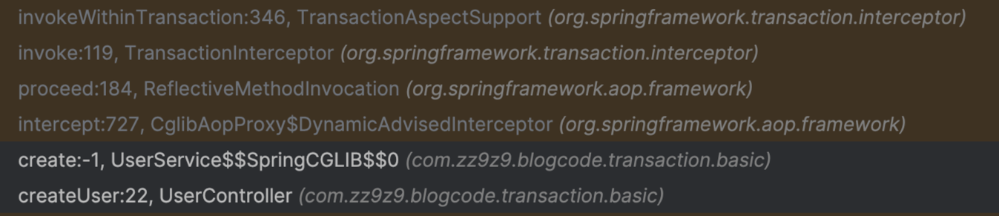
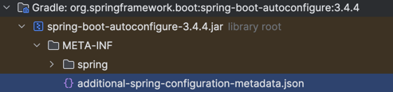

===============
- `@Service` 에서만 사용하는건가 ?
- 어떻게 하나의 커넥션이 사용되나 ?
- 주의사항 (private 메서드)
- 테스트 코드에서의 사용 의견 나뉘는거
- readonly ?


- @EnableTransactionManagement → TransactionManagementConfigurationSelector
  - auto-config ?
- CglibAopProxy
- ReflectiveMethodInvocation
- TransactionInterceptor
- TransactionAspectSupport


### Enhancer


- TestServiceImpl$$SpringCGLIB는 언제, 어떻게 생성되나요?	Spring AOP가 CGLIB Enhancer로 런타임에 생성함 (프록시 서브클래스)

- ObjenesisCglibAopProxy인거같은데 ?

```
org.springframework.aop.framework.CglibAopProxy#buildProxy
```
- 서브클래스 생성 (Spring이 이를 통해 TestServiceImpl$$SpringCGLIB$$0 생성)
  


### 스프링부트 기준
> CGLIB가 기본
- By default, Spring Boot’s auto-configuration configures Spring AOP to use CGLib proxies.
- To use JDK proxies instead, set configprop:spring.aop.proxy-target-class to false.
  https://docs.spring.vmware.com/spring-boot/docs/3.0.14/reference/htmlsingle/#features.aop





- 명시적으로 `@EnableAspectJAutoProxy(proxyTargetClass = false)` 또는 application.properties에 다음 설정을 추가해야 합니다:


Spring Framework: 왜 JDK Proxy가 기본인가?
Spring의 철학은 "인터페이스 기반 프로그래밍"을 권장

따라서 프록시도 **JDK 동적 프록시 (인터페이스 기반)**을 기본으로 선택

클래스에 대해 프록시를 만들려면 proxyTargetClass = true 명시적으로 설정해야 함

java
복사
편집
@EnableAspectJAutoProxy(proxyTargetClass = true) // → CGLIB 사용 강제
🔍 Spring Boot: 왜 CGLIB이 기본인가?
Spring Boot는 **"편의성과 일관성"**을 중요시합니다.

많은 개발자들이 인터페이스 없이도 AOP 사용을 원함

특히 @Transactional, @Async, @Scheduled 같은 어노테이션 기반 기능은 클래스에 붙는 경우가 많음

그래서 Spring Boot는 자동 설정으로 CGLIB을 기본으로 사용하도록 설정함

```
spring.aop.proxy-target-class=false
```

- 또는 Java config:

```java
@Configuration
@EnableAspectJAutoProxy(proxyTargetClass = false)
public class AopConfig {
}
```


## AspectJ ?

## 관련 클래스
> 스프링부트 기준

### TransactionInterceptor, TransactionAspectSupport

```java
// org.springframework.boot.autoconfigure.transaction.TransactionAutoConfiguration
@AutoConfiguration
@ConditionalOnClass({PlatformTransactionManager.class})
public class TransactionAutoConfiguration {
  public TransactionAutoConfiguration() {
  }

  ...

  @Configuration(
    proxyBeanMethods = false
  )
  @ConditionalOnSingleCandidate(PlatformTransactionManager.class)
  public static class TransactionTemplateConfiguration {
    public TransactionTemplateConfiguration() {
    }

    @Bean
    @ConditionalOnMissingBean({TransactionOperations.class})
    public TransactionTemplate transactionTemplate(PlatformTransactionManager transactionManager) {
      return new TransactionTemplate(transactionManager);
    }
  }
}
```

```java
// org.springframework.transaction.annotation.ProxyTransactionManagementConfiguration
@Configuration(
    proxyBeanMethods = false
)
@Role(2)
@ImportRuntimeHints({TransactionRuntimeHints.class})
public class ProxyTransactionManagementConfiguration extends AbstractTransactionManagementConfiguration {
    public ProxyTransactionManagementConfiguration() {
    }

    @Bean(
        name = {"org.springframework.transaction.config.internalTransactionAdvisor"}
    )
    @Role(2)
    public BeanFactoryTransactionAttributeSourceAdvisor transactionAdvisor(TransactionAttributeSource transactionAttributeSource, TransactionInterceptor transactionInterceptor) {
        BeanFactoryTransactionAttributeSourceAdvisor advisor = new BeanFactoryTransactionAttributeSourceAdvisor();
        advisor.setTransactionAttributeSource(transactionAttributeSource);
        advisor.setAdvice(transactionInterceptor);  // transactionInterceptor 세팅
        if (this.enableTx != null) {
            advisor.setOrder((Integer)this.enableTx.getNumber("order"));
        }

        return advisor;
    }

    @Bean
    @Role(2)
    public TransactionInterceptor transactionInterceptor(TransactionAttributeSource transactionAttributeSource) {
        TransactionInterceptor interceptor = new TransactionInterceptor();
        interceptor.setTransactionAttributeSource(transactionAttributeSource);
        if (this.txManager != null) {
            interceptor.setTransactionManager(this.txManager);
        }

        return interceptor;
    }
}
```


## ReadOnly

## CheckedException rollback

## @Transactional 안붙은 메서드는 ?


## 참고 자료
- [https://docs.spring.io/spring-framework/reference/core/aop/introduction-proxies.html](https://docs.spring.io/spring-framework/reference/core/aop/introduction-proxies.html)
- [https://docs.spring.io/spring-framework/reference/core/aop/proxying.html](https://docs.spring.io/spring-framework/reference/core/aop/proxying.html)
- [https://docs.spring.io/spring-framework/reference/data-access/transaction/declarative/annotations.html](https://docs.spring.io/spring-framework/reference/data-access/transaction/declarative/annotations.html)
