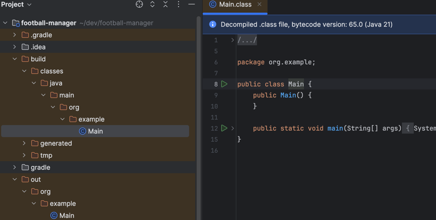

> https://github.com/spring-projects/spring-boot/wiki/Building-On-Spring-Boot

## Auto-configuration
- 현재 클래스패스(Classpath)에 있는 라이브러리를 기준으로 자동으로 Spring Bean을 설정해주는 기능입니다.
  - 예: spring-webmvc가 있으면 DispatcherServlet, RequestMappingHandlerMapping 등을 자동 설정.

- `spring-boot-autoconfigure` 모듈이 다음과 같은 자동 설정을 포함:
  - 즉, 클래스패스에 spring-webmvc만 있어도 자동으로 웹 애플리케이션이 구성됨

```java
@Configuration
@ConditionalOnClass(DispatcherServlet.class)
@AutoConfigureOrder(Ordered.HIGHEST_PRECEDENCE)
public class DispatcherServletAutoConfiguration {
    // DispatcherServlet Bean 자동 등록
}
```

The concept of auto-configuration and starter-POMs are related, but not directly tied:

- Auto-configuration is responsible for reacting to the current state of an application and configuring appropriate Spring Beans.
- More often than not, the primary driver for auto-configuration will be the users classpath.


- classpath란?
자바 애플리케이션이 실행되면서 .class 파일이나 .jar 파일을 찾을 수 있도록 지정된 경로 목록입니다.
Gradle이나 Maven은 자동으로 이 classpath를 구성해줍니다.


- Maven 구조
```
my-app/
├── src/
│   ├── main/
│   │   ├── java/               ← 소스 코드
│   │   └── resources/          ← 설정 파일, 정적 리소스
│   └── test/
│       ├── java/
│       └── resources/
├── target/
│   ├── classes/                ← 컴파일된 클래스
│   └── test-classes/          ← 테스트 클래스
└── pom.xml                    ← 의존성 정의
```

compile classpath:
src/main/java의 .class + pom.xml에 선언된 <dependencies> 의 .jar 포함

test classpath:
compile classpath + src/test/java + <scope>test</scope> 의존성


| 구분                                | 설명                           | 예시                             |
| --------------------------------- | ---------------------------- | ------------------------------ |
| **컴파일 클래스패스 (Compile Classpath)** | 자바 소스를 컴파일할 때 필요한 클래스, 라이브러리 | 인터페이스, 어노테이션, 추상 클래스 등         |
| **런타임 클래스패스 (Runtime Classpath)** | 애플리케이션을 실행할 때 필요한 클래스, 라이브러리 | JDBC 드라이버, 로깅 구현체, 실제 구현 클래스 등 |

컴파일패스 : javac -cp "lib/lombok.jar" src/Main.java -d build
런타임패스 : java -cp "lib/mysql-connector.jar:build" Main


- Gradle 구조

```
my-app/
├── src/
│   ├── main/
│   │   ├── java/               ← 소스 코드
│   │   └── resources/
│   └── test/
│       ├── java/
│       └── resources/
├── build/
│   ├── classes/java/main/     ← 컴파일된 클래스
│   └── libs/
└── build.gradle               ← 의존성 정의
```

Gradle은 다음처럼 classpath를 구분해 관리합니다:

| 키워드                  | 컴파일에 포함 | 런타임에 포함 | 외부 모듈에서 접근 가능 |
| -------------------- | ------- | ------- | ------------- |
| `api`                | ✅       | ✅       | ✅             |
| `implementation`     | ✅       | ✅       | ❌             |
| `compileOnly`        | ✅       | ❌       | ❌             |
| `runtimeOnly`        | ❌       | ✅       | ❌             |
| `testImplementation` | 테스트 전용  | 테스트 전용  | ❌             |


- 컴파일 classpath 보기
`./gradlew dependencies --configuration compileClasspath`

- 테스트 classpath 보기
`./gradlew dependencies --configuration testRuntimeClasspath`

| 빌드 도구      | classpath 구성 방식                                                        |
| ---------- | ---------------------------------------------------------------------- |
| **Maven**  | `<dependencies>`에 정의된 라이브러리 + `target/classes/`                        |
| **Gradle** | `implementation`, `runtimeOnly` 등 스코프별 구성 + `build/classes/java/main/` |
| 공통점        | 모두 자동으로 `.class`, `.jar`를 classpath에 포함시켜줌                             |


classpath는 이런 상황에서 필요합니다

| 상황             | 설명                                              |
| -------------- | ----------------------------------------------- |
| **컴파일 시**      | 내가 `import`한 클래스가 어디 있는지 `javac`가 찾기 위해         |
| **실행 시**       | JVM이 `new ObjectMapper()` 등 외부 클래스 인스턴스를 만들기 위해 |
| **IDE/빌드툴에서도** | IntelliJ나 Gradle도 내부적으로 classpath를 설정해줌         |

```
dependencies {
  implementation 'org.springframework.boot:spring-boot-starter-web'
}
```

→ Gradle은 Spring Boot 관련 .jar들을 .gradle/caches에서 모아서 classpath를 만들고
→ javac -cp ... / java -cp ... 호출할 때 자동 지정해줍니다.


Gradle - JDK 버전 호환성

```
./gradlew compileJava  하니까 * What went wrong:
A problem occurred configuring root project 'football-manager'.
> Could not open cp_proj generic class cache for build file '/Users/jeayoon/dev/football-manager/build.gradle' (/Users/jeayoon/.gradle/caches/8.4/scripts/5q7u3yczkps7iw7dai2jqliqf).
   > BUG! exception in phase 'semantic analysis' in source unit '_BuildScript_' Unsupported class file major version 66

이렇게 뜨네


ChatGPT의 말:
이 에러는 아주 전형적인 JDK 버전 불일치 문제입니다.
정확히 말하면:

❗️ "Unsupported class file major version 66"
→ Gradle이 Java 22로 컴파일된 클래스 파일을 읽으려 했지만,
사용 중인 Gradle 또는 JVM이 이를 지원하지 않아서 실패한 것입니다.
```

```
 javac \
  -cp "/Users/jeayoon/.gradle/caches/modules-2/files-2.1/org.projectlombok/lombok/1.18.32/17d46b3e205515e1e8efd3ee4d57ce8018914163/lombok-1.18.32.jar" \
  -processorpath "/Users/jeayoon/.gradle/caches/modules-2/files-2.1/org.projectlombok/lombok/1.18.32/17d46b3e205515e1e8efd3ee4d57ce8018914163/lombok-1.18.32.jar" \
-d ./  ../src/main/java/org/example/Main.java
```

.jar 파일로 패키징해도, 외부 라이브러리를 사용한다면 -cp 옵션은 필요합니다.
다만, fat jar 또는 Spring Boot의 executable jar 같이 모든 의존성을 포함한 jar는 -cp 없이 실행할 수 있어요.


클래스 이름은 파일명이 아니라 패키지를 포함한 이름이어야 함
→ org.example.Main

자바는 클래스의 fully-qualified name (= 패키지 + 클래스명) 과
실제 파일 위치(디렉토리 구조)가 정확히 일치해야 합니다.




## Jar와 classpath
예제 1: 일반 JAR + 외부 라이브러리
bash
복사
편집
# MyApp.class를 jar로 압축
jar cf myapp.jar com/example/MyApp.class
bash
복사
편집
# 실행 시 외부 라이브러리 필요
java -cp myapp.jar:lib/slf4j-api.jar com.example.MyApp
💡 여러 .jar 파일을 포함해야 하면 -cp에 :로 연결하거나 와일드카드(*) 사용:

bash
복사
편집
java -cp "myapp.jar:lib/*" com.example.MyApp
(macOS/Linux 기준, Windows는 ; 사용)

✅ 예제 2: fat jar (classpath 불필요)
Gradle의 shadow 플러그인이나 Spring Boot의 bootJar는
모든 의존성을 .jar 하나에 압축 포함시켜 줍니다.

bash
복사
편집
./gradlew shadowJar
java -jar build/libs/myapp-all.jar  # 외부 -cp 필요 없음
Spring Boot 예:

bash
복사
편집
./gradlew bootJar
java -jar build/libs/myapp-0.0.1-SNAPSHOT.jar
→ 내부적으로 org.springframework.boot.loader.Launcher가 classpath 설정을 자동으로 처리함


## WAR와 classpath
.jar와 함께 자바에서 자주 쓰이는 또 다른 배포 포맷인 .war 파일은 웹 애플리케이션용 패키징 포맷인데, classpath와 관련해서도 몇 가지 중요한 차이가 있습니다.

✅ 먼저 정리: .war는 어떤 포맷인가?
.war (Web Application Archive)는 웹 서버 (예: Tomcat, Jetty) 에 배포하기 위한 포맷입니다.
.jar처럼 ZIP 형식이지만 구조와 목적이 다릅니다.

✅ WAR 파일 구조 예시
text
복사
편집
myapp.war
├── WEB-INF/
│   ├── web.xml                ← (서블릿 설정)
│   ├── classes/               ← 컴파일된 .class 파일
│   └── lib/                   ← 의존성 .jar 파일
✅ WAR 실행 방식
실행 방식	설명
✅ Servlet 컨테이너(Tomcat 등)에 배포	WAR 파일을 컨테이너가 해석하고 실행
⚠️ 단독으로 java -jar로 실행 ❌	기본적으로는 실행되지 않음

예:
Tomcat의 webapps/ 폴더에 myapp.war 복사

Tomcat이 자동으로 압축 해제 및 실행

✅ classpath는 어떻게 구성될까?
WAR 파일의 classpath는 Servlet 컨테이너(Tomcat 등) 가 다음 순서로 자동 설정합니다:

순서	classpath 포함 경로
1️⃣	/WEB-INF/classes/ 안의 .class 파일들
2️⃣	/WEB-INF/lib/*.jar 모든 JAR 파일들
3️⃣	(컨테이너 공통 클래스 경로) 예: lib/servlet-api.jar

✅ 개발자가 -cp로 classpath 지정할 필요는?
❌ 없습니다.
컨테이너가 자동으로 설정합니다.

→ 즉, .war 파일 내 구조만 제대로 갖추면, 별도 -cp 옵션은 필요 없습니다.

✅ 그럼 Spring Boot의 WAR는?
Spring Boot에서도 .war로 빌드할 수 있습니다. 다만:

외부 Tomcat에 배포하면 → WAR 구조에 따라 동작 (Spring Boot의 내장 Tomcat은 사용 안 함)

내장 Tomcat으로 실행하고 싶으면 → 보통 .jar로 빌드하거나 fat war로 만듭니다

📌 Spring Boot WAR 실행 예시 (내장 서버 포함)
bash
복사
편집
java -jar myapp.war
이건 Spring Boot WAR가 fat war로 만들어졌을 때만 가능합니다.

✅ 요약 비교: .jar vs .war
항목	.jar	.war
목적	일반 Java 실행	웹 애플리케이션 배포
실행 방식	java -jar 또는 -cp	Servlet 컨테이너가 실행
classpath 수동 지정 필요?	✅ 필요 (-cp 등)	❌ 컨테이너가 자동 지정
외부 라이브러리 위치	아무 곳 + -cp	/WEB-INF/lib 아래 JAR
실행 가능?	즉시 실행 가능	기본은 배포용, 실행하려면 컨테이너 필요

✅ 결론
.war는 웹 컨테이너가 알아서 classpath를 구성해 주기 때문에,
실행 시 -cp를 직접 지정할 필요는 없습니다.
단, .war 내부 구조 (WEB-INF/classes, WEB-INF/lib)를 제대로 만들기만 하면 OK입니다.

필요하시면 .jar vs .war vs .ear 정리, 또는 Spring Boot에서 .war를 빌드하는 설정도 도와드릴게요!


## Starter POMs
- Starter POMs are responsible for pulling in dependencies that are commonly used together.
- 자주 같이 사용하는 의존성들을 묶어서 한 번에 추가할 수 있게 만든 BOM(빌드 의존성 관리).
  - ex : [spring-boot-starter-webmvc](https://github.com/spring-projects/spring-boot/blob/main/starter/spring-boot-starter-webmvc/build.gradle)
  - 그렇다고 maven repo에서 꼭 이 이름은 아닌듯

- 🔹 Starter POM을 의존하면 안 되는 경우
  라이브러리 개발자는 spring-boot-starter-xxx보다는 실제 라이브러리에 의존해야 합니다.
  예: spring-webmvc, spring-data-jpa 등

이유: Starter에는 불필요한 의존성이 많이 포함되어 있어, 유연성 떨어짐

🔹 예외
Starter가 다른 Starter를 의존하는 건 OK
예: spring-boot-starter → spring-boot-starter-logging, spring-boot-autoconfigure 등

## SpringApplication
> https://docs.spring.io/spring-boot/reference/features/spring-application.html

The SpringApplication class provides a convenient way to bootstrap a Spring application that is started from a main() method.
In many situations, you can delegate to the static `SpringApplication.run(Class, String…)` method, as shown in the following example:

```java
@SpringBootApplication
public class MyApplication {

	public static void main(String[] args) {
		SpringApplication.run(MyApplication.class, args);
	}

}
```
