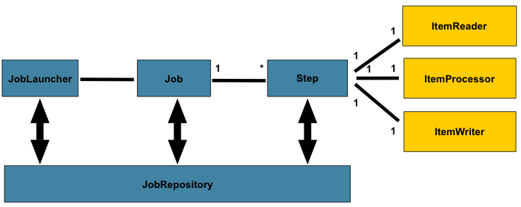
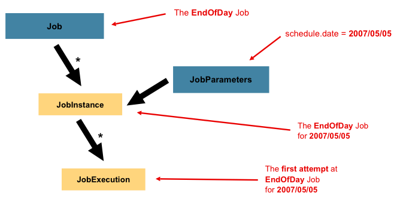

- 하나의 Job은 하나 이상의 Step을 가지며, 각각의 Step은 정확히 하나의 ItemReader, 하나의 ItemProcessor, 그리고 하나의 ItemWriter를 가진다.
- Job은 `JobLauncher`를 통해 실행되어야 하며, 현재 실행 중인 프로세스에 대한 메타데이터는 `JobRepository`에 저장되어야 한다.
  - the JobRepository is used for basic CRUD operations of the various persisted domain objects within Spring Batch, such as JobExecution and StepExecution.

## Job
> 잡(Job)은 전체 배치 프로세스를 캡슐화하는 엔티티

- 잡은 단순히 Step 인스턴스들을 담는 컨테이너일 뿐이다.
- 잡은 논리적으로 함께 속하는 여러 스텝을 하나의 플로우에 결합하며, 모든 스텝에 공통되는 속성들(예: 재시작 가능성)을 설정할 수 있게 해준다.


```
Job (인터페이스)
|
AbstractJob (추상클래스) -> job실행시 공통적인 부분 처리 (jobRepository에 정보 저장 등)
|
SimpleJob (구현클래스), FlowJob (구현클래스)
```

- Abstract implementation of the Job interface. Common dependencies such as a JobRepository, JobExecutionListeners, and various configuration parameters are set here. Therefore, common error handling and listener calling activities are abstracted away from implementations.

- Spring Batch는 Job 인터페이스의 기본 구현체를 SimpleJob 클래스 형태로 제공
- Job을 인스턴스화하기 위해 빌더들의 모음이 제공

```java
@Bean
public Job footballJob(JobRepository jobRepository) {
    return new JobBuilder("footballJob", jobRepository)
                     .start(playerLoad())
                     .next(gameLoad())
                     .next(playerSummarization())
                     .build();
}
```

```java
// org.springframework.batch.core.job.SimpleJob#doExecute
@Override
protected void doExecute(JobExecution execution)
  throws JobInterruptedException, JobRestartException, StartLimitExceededException {

  StepExecution stepExecution = null;
  for (Step step : steps) {
    stepExecution = handleStep(step, execution);
    if (stepExecution.getStatus() != BatchStatus.COMPLETED) {
      //
      // Terminate the job if a step fails
      //
      break;
    }
  }

  //
  // Update the job status to be the same as the last step
  //
  if (stepExecution != null) {
    if (logger.isDebugEnabled()) {
      logger.debug("Upgrading JobExecution status: " + stepExecution);
    }
    execution.upgradeStatus(stepExecution.getStatus());
    execution.setExitStatus(stepExecution.getExitStatus());
  }
}
```

## JobInstance
> JobInstance : 논리적 실행 단위



- 예를 들어 (앞선 다이어그램의) `EndOfDay` Job은 하나뿐이지만, 잡의 각 실행(run)은 개별적으로 추적되어야 한다.
- 이 잡의 경우 하루마다 하나의 논리적 JobInstance가 존재한다.
  - 예를 들어, 1월 1일 실행, 1월 2일 실행 등이 있다.
  - 만약 1월 1일 실행이 처음에 실패하고 다음 날 다시 실행된다 하더라도, 그것은 여전히 1월 1일 실행이다. (보통 이는 처리되는 데이터와도 대응되며, 1월 1일 실행은 1월 1일 데이터를 처리한다는 의미이다.)
- 따라서 각 JobInstance는 여러 번의 실행(JobExecution)을 가질 수 있으며, 특정 Job과 그것을 식별하는 JobParameters에 대응되는 JobInstance은 동시에 하나만 실행될 수 있다.
- 새로운 JobInstance를 사용하는 것은 “처음부터 시작”을 의미하며, 기존 인스턴스를 사용하는 것은 일반적으로(ExecutionContext을 활용하여) “이전 실행 지점부터 이어서 시작”을 의미한다.

## JobParameters
> JobParameters : 각각의 JobInstance를 식별하는 요소

- JobParameters 객체는 배치 잡을 시작하는 데 사용되는 파라미터 집합을 담는다.
- 이들은 식별용으로 사용될 수 있으며, 실행 중 참조 데이터로도 사용될 수 있다.
- 앞선 예시에서 1월 1일과 1월 2일 두 개의 인스턴스가 있을 때, 실제로는 Job은 하나뿐이지만, 두 개의 JobParameter 객체가 있다. 하나는 01-01-2017이라는 JobParameter로 시작된 것이고, 다른 하나는 01-02-2017이라는 파라미터로 시작된 것이다.
- 따라서 다음과 같이 표현될 수 있다: `JobInstance = Job + 식별용 JobParameters`
- 기본적으로 JobParameters는 JobInstance를 구별하는 키 역할을 하지만, 모든 파라미터가 그럴 필요는 없습니다.
- 예:
  - date=2017-01-01 → 식별용 (JobInstance 구분에 사용됨)
  - requestId=12345 → 실행 시 참조 데이터로만 사용, JobInstance 식별에는 불필요
- Spring Batch는 이러한 구분을 지원하여, 필요 없는 파라미터는 JobInstance 식별에서 제외할 수 있게 합니다.


=> `BATCH_JOB_INSTANCE`의 `JOB_KEY`가 파라미터의 해시값

```java
// org.springframework.batch.core.repository.dao.JdbcJobInstanceDao#createJobInstance

@Override
public JobInstance createJobInstance(String jobName, JobParameters jobParameters) {

  Assert.notNull(jobName, "Job name must not be null.");
  Assert.notNull(jobParameters, "JobParameters must not be null.");

  Assert.state(getJobInstance(jobName, jobParameters) == null, "JobInstance must not already exist");

  Long jobInstanceId = jobInstanceIncrementer.nextLongValue();

  JobInstance jobInstance = new JobInstance(jobInstanceId, jobName);
  jobInstance.incrementVersion();

  Object[] parameters = new Object[] { jobInstanceId, jobName, jobKeyGenerator.generateKey(jobParameters),
    jobInstance.getVersion() };
  getJdbcTemplate().update(getQuery(CREATE_JOB_INSTANCE), parameters,
    new int[] { Types.BIGINT, Types.VARCHAR, Types.VARCHAR, Types.INTEGER });

  return jobInstance;
}
```


- batch.core.job.SimpleStepHandler     : Step already complete or not restartable, so no action to execute: StepExecution: id=10, version=5, name=step1, status=COMPLETED, exitStatus=COMPLETED, readCount=5, filterCount=0, writeCount=5 readSkipCount=0, writeSkipCount=0, processSkipCount=0, commitCount=3, rollbackCount=0, exitDescription=


- job이름 , 파라미터로 실행 내역을 찾는다.

```java
// org.springframework.batch.core.launch.support.TaskExecutorJobLauncher#run
jobExecution = jobRepository.createJobExecution(job.getName(), jobParameters);

		try {
			taskExecutor.execute(new Runnable() {

				@Override
				public void run() {
            ...
						job.execute(jobExecution);
```

- 찾은 실행 내역에서 `JobInstance`를 가져온다.

```java
// org.springframework.batch.core.job.SimpleStepHandler#handleStep
JobInstance jobInstance = execution.getJobInstance();

StepExecution lastStepExecution = jobRepository.getLastStepExecution(jobInstance, step.getName());
if (stepExecutionPartOfExistingJobExecution(execution, lastStepExecution)) {
	// If the last execution of this step was in the same job, it's
	// probably intentional so we want to run it again...
	if (logger.isInfoEnabled()) {
		logger.info(String.format(
				"Duplicate step [%s] detected in execution of job=[%s]. "
						+ "If either step fails, both will be executed again on restart.",
				step.getName(), jobInstance.getJobName()));
	}
	lastStepExecution = null;
}
StepExecution currentStepExecution = lastStepExecution;

if (shouldStart(lastStepExecution, execution, step)) {
  ...
}
```

- // org.springframework.batch.core.repository.dao.JdbcStepExecutionDao#GET_LAST_STEP_EXECUTION
  // => jobRepository.getLastStepExecution 호출로 실행되는 쿼리

```sql
SELECT ...
FROM BATCH_JOB_EXECUTION JE
    JOIN BATCH_STEP_EXECUTION SE ON SE.JOB_EXECUTION_ID = JE.JOB_EXECUTION_ID
WHERE JE.JOB_INSTANCE_ID = ?
  AND SE.STEP_NAME = ?
```

- StepExecution의 stepStatus 가 COMPLETED인데 `allowStartIfComplete` 속성이 `false`이거나 stepStatus가 `ABANDONED` 이면 특정 job을 동일한 파라미터로 재실행 불가능

```java
// org.springframework.batch.core.job.SimpleStepHandler#shouldStart
protected boolean shouldStart(StepExecution lastStepExecution, JobExecution jobExecution, Step step)
		throws JobRestartException, StartLimitExceededException {

	BatchStatus stepStatus;
	if (lastStepExecution == null) {
		stepStatus = BatchStatus.STARTING;
	}
	else {
		stepStatus = lastStepExecution.getStatus();
	}

  ...

	if ((stepStatus == BatchStatus.COMPLETED && !step.isAllowStartIfComplete())
			|| stepStatus == BatchStatus.ABANDONED) {
		// step is complete, false should be returned, indicating that the
		// step should not be started
		if (logger.isInfoEnabled()) {
			logger.info("Step already complete or not restartable, so no action to execute: " + lastStepExecution);
		}
		return false;
	}

  ...

}
```


- Caused by: org.springframework.batch.core.repository.JobExecutionAlreadyRunningException: A job
execution for this job is already running: JobInstance: id=1, version=0, Job=[importUserJob]

=>
```java
// org.springframework.batch.core.repository.support.SimpleJobRepository#createJobExecution
@Override
public JobExecution createJobExecution(String jobName, JobParameters jobParameters)
		throws JobExecutionAlreadyRunningException, JobRestartException, JobInstanceAlreadyCompleteException {

	Assert.notNull(jobName, "Job name must not be null.");
	Assert.notNull(jobParameters, "JobParameters must not be null.");

	JobInstance jobInstance = jobInstanceDao.getJobInstance(jobName, jobParameters);
	ExecutionContext executionContext;

	if (jobInstance != null) {

		List<JobExecution> executions = jobExecutionDao.findJobExecutions(jobInstance);

		if (executions.isEmpty()) {
			throw new IllegalStateException("Cannot find any job execution for job instance: " + jobInstance);
		}

		for (JobExecution execution : executions) {
			if (execution.isRunning()) {
				throw new JobExecutionAlreadyRunningException(
						"A job execution for this job is already running: " + jobInstance);
			}

      ...
		}
		executionContext = ecDao.getExecutionContext(jobExecutionDao.getLastJobExecution(jobInstance));
	}

  ...

	return jobExecution;

}
```

```java
// org.springframework.batch.core.BatchStatus
public enum BatchStatus {

  /**
   * The batch job has successfully completed its execution.
   */
  COMPLETED,
  /**
   * Status of a batch job prior to its execution.
   */
  STARTING,
  /**
   * Status of a batch job that is running.
   */
  STARTED,
  /**
   * Status of batch job waiting for a step to complete before stopping the batch job.
   */
  STOPPING,
  /**
   * Status of a batch job that has been stopped by request.
   */
  STOPPED,
  /**
   * Status of a batch job that has failed during its execution.
   */
  FAILED,
  /**
   * Status of a batch job that did not stop properly and can not be restarted.
   */
  ABANDONED,
  /**
   * Status of a batch job that is in an uncertain state.
   */
  UNKNOWN;

  public boolean isRunning() {
    return this == STARTING || this == STARTED || this == STOPPING;
  }

  ...

}

```

### JobParameters를 아예 안넘기는 경우에는 ?
- JobLauncher.run(Job, JobParameters) 를 실행할 때 JobParameters를 비워서(null 또는 empty) 넘기면, 내부적으로는 빈 JobParameters 객체가 사용됩니다.
- 이 경우 항상 동일한 JobInstance로 인식됩니다.
- 즉, 같은 Job을 아무리 다시 실행해도 새로운 JobInstance가 만들어지지 않고, 동일한 JobInstance에 새로운 JobExecution이 추가됩니다.

## JobExecution
> '실행 시도'를 나타내는 개념

- 해당 실행과 연결된 JobInstance는 실행이 성공적으로 완료될 때까지 완료된 것으로 간주되지 않는다.
- 예를 들어 앞서 설명한 EndOfDay Job을 기준으로, 2017년 1월 1일의 JobInstance가 첫 실행에서 실패했다고 가정해 보자.
- 동일한 식별 JobParameters(2017-01-01)로 다시 실행하면 새로운 JobExecution이 생성된다.
- 그러나 여전히 JobInstance는 하나뿐이다.

| 속성                    | 정의                                                                      |
| --------------------- | ----------------------------------------------------------------------- |
| **Status**            | 실행 상태(`BatchStatus`). 실행 중이면 `STARTED`, 실패하면 `FAILED`, 성공하면 `COMPLETED` |
| **startTime**         | 실행이 시작된 시각 (`LocalDateTime`)                                            |
| **endTime**           | 실행이 끝난 시각 (`LocalDateTime`) – 성공/실패와 무관                                 |
| **exitStatus**        | 실행 결과(`ExitStatus`). 실행이 끝난 경우 반환 코드 포함                                 |
| **createTime**        | JobExecution이 처음 저장된 시각. 시작 전일 수도 있지만 항상 존재                             |
| **lastUpdated**       | JobExecution이 마지막으로 저장된 시각                                              |
| **executionContext**  | 실행 간에 유지해야 할 사용자 데이터 저장 공간                                              |
| **failureExceptions** | 실행 중 발생한 예외 목록. 실패 시 여러 개 있을 수 있음                                       |

### 예시 상황

> EndOfDayJob 2017-01-01 실행 (21:00 시작 → 21:30 실패) <br>
> 다음날 같은 파라미터로 재실행 → 성공 (21:00 → 21:30) <br>
> 이어서 2017-01-02 실행 → 성공 (21:31 → 22:29)

- `BATCH_JOB_INSTANCE` 테이블

| JOB\_INST\_ID | JOB\_NAME   |
| ------------- | ----------- |
| 1             | EndOfDayJob |
| 2             | EndOfDayJob |


- `BATCH_JOB_EXECUTION` 테이블

| JOB\_EXEC\_ID | JOB\_INST\_ID | START\_TIME      | END\_TIME        | STATUS    |
| ------------- | ------------- | ---------------- | ---------------- | --------- |
| 1             | 1             | 2017-01-01 21:00 | 2017-01-01 21:30 | FAILED    |
| 2             | 1             | 2017-01-02 21:00 | 2017-01-02 21:30 | COMPLETED |
| 3             | 2             | 2017-01-02 21:31 | 2017-01-02 22:29 | COMPLETED |


## 참고 자료
- [https://docs.spring.io/spring-batch/reference/domain.html](https://docs.spring.io/spring-batch/reference/domain.html)
- [https://docs.spring.io/spring-batch/reference/job/configuring-repository.html](https://docs.spring.io/spring-batch/reference/job/configuring-repository.html)
