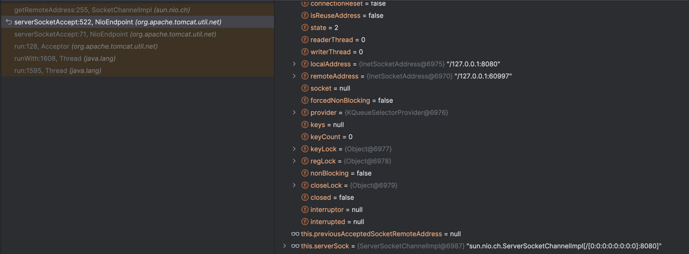
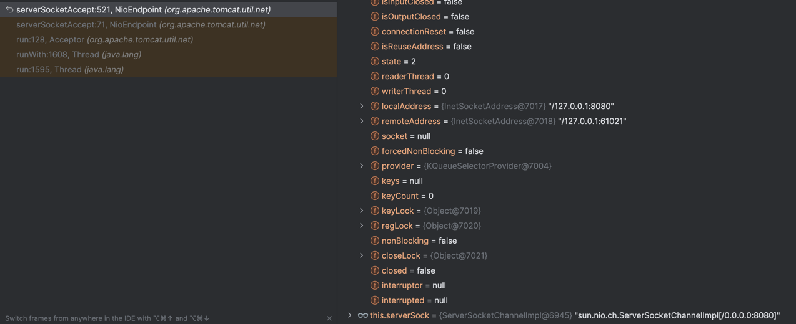
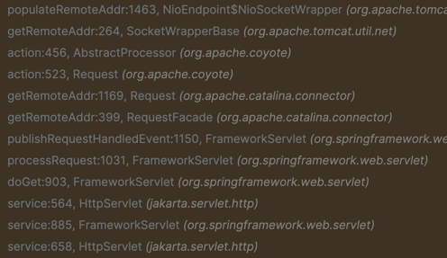

## 듀얼 스택 소켓
> https://whatismyipaddress.com/dual-stack
> https://docs.oracle.com/javase/8/docs/technotes/guides/net/ipv6_guide/


=> -Djava.net.preferIPv6Addresses=true
=> `http://[::1]:8080/api/foo`, `http://127.0.0.1:8080/api/foo` 모두 통신 가능



=> -Djava.net.preferIPv4Stack=true
=> `http://[::1]:8080/api/foo` 로 통신 불가능

## 왜 어떨때는 IPv4 주소이고 어떨때는 IPv6 주소일까 ?
- ✔ IPv6 활성 상태 (disable_ipv6=0)
  클라이언트가 127.0.0.1로 요청했더라도,

커널은 IPv6 스택을 통해 ::ffff:127.0.0.1 또는 ::1로 보낼 수 있음 (Dual Stack 환경)

JVM은 이걸 IPv6 커넥션으로 받아들이고, InetAddress.getHostAddress() 결과도 IPv6 주소

getRemoteAddr() → ::1 혹은 ::ffff:127.0.0.1

🔍 IPv6 mapped IPv4란?
IPv4 주소를 IPv6처럼 표현하는 방식: ::ffff:127.0.0.1

Dual Stack 소켓에서 IPv4 요청을 받을 때 흔히 이렇게 표현됨

getHostAddress()는 이를 그대로 출력


## -Djava.net.preferIPv4Stack=true 역할
> https://docs.oracle.com/en/java/javase/11/docs/api/java.base/java/net/doc-files/net-properties.html

IPv4 / IPv6
java.net.preferIPv4Stack (default: false)
If IPv6 is available on the operating system the underlying native socket will be, by default, an IPv6 socket which lets applications connect to, and accept connections from, both IPv4 and IPv6 hosts. However, in the case an application would rather use IPv4 only sockets, then this property can be set to true. The implication is that it will not be possible for the application to communicate with IPv6 only hosts.

java.net.preferIPv6Addresses (default: false)
When dealing with a host which has both IPv4 and IPv6 addresses, and if IPv6 is available on the operating system, the default behavior is to prefer using IPv4 addresses over IPv6 ones. This is to ensure backward compatibility, for example applications that depend on the representation of an IPv4 address (e.g. 192.168.1.1). This property can be set to true to change that preference and use IPv6 addresses over IPv4 ones where possible, or system to preserve the order of the addresses as returned by the operating system.

- 이 JVM 옵션을 사용하면:

1. JVM이 소켓을 열 때 IPv6 대신 IPv4 전용 소켓을 생성합니다.
- Dual Stack (::) 소켓이 아니라 0.0.0.0만 바인딩됨
- 즉, IPv6 요청은 수락조차 하지 않음

2. 클라이언트와 서버 사이에 IPv6 기반 커넥션이 아예 성립하지 않게 됩니다.
3. 이로 인해 getRemoteAddr()에서는 IPv6 주소를 얻을 일이 아예 없음
- 그래서 결과적으로 항상 127.0.0.1 등 IPv4 주소가 나옴

```
// src/java.base/share/native/libnet/net_util.c

JNIEXPORT jint JNICALL
DEF_JNI_OnLoad(JavaVM *vm, void *reserved)
{
    JNIEnv *env;
    jclass iCls;
    jmethodID mid;
    jstring s;
    jint preferIPv4Stack;
    if ((*vm)->GetEnv(vm, (void**) &env, JNI_VERSION_1_2) != JNI_OK) {
        return JNI_EVERSION; /* JNI version not supported */
    }

    iCls = (*env)->FindClass(env, "java/lang/Boolean");
    CHECK_NULL_RETURN(iCls, JNI_VERSION_1_2);
    mid = (*env)->GetStaticMethodID(env, iCls, "getBoolean", "(Ljava/lang/String;)Z");
    CHECK_NULL_RETURN(mid, JNI_VERSION_1_2);
    s = (*env)->NewStringUTF(env, "java.net.preferIPv4Stack");
    CHECK_NULL_RETURN(s, JNI_VERSION_1_2);
    preferIPv4Stack = (*env)->CallStaticBooleanMethod(env, iCls, mid, s);

    /*
     * Since we have initialized and loaded the socket library we will
     * check now whether we have IPv6 on this platform and if the
     * supporting socket APIs are available
     */
    IPv4_available = IPv4_supported();
    IPv6_available = IPv6_supported() & (!preferIPv4Stack);

    /* check if SO_REUSEPORT is supported on this platform */
    REUSEPORT_available = reuseport_supported(IPv6_available);

    return JNI_VERSION_1_2;
}
```


## 코드 레벨

루프백 ?

- `Djava.net.preferIPv4Stack=true`

- curl은 /etc/hosts의 localhost 설정도 따릅니다:

```
::1       localhost
127.0.0.1 localhost
```

- api/foo 호출시 request.getRemoteAddr()로 client ip 찍고, 로컬 서버에서 curl로 호출했을때 api/foo를 반복해서 호출해보면, 어떨때는 ipv4로 찍히고 어떨때는 ipv6로 찍힌다

- 운영체제와 JVM은 IPv4와 IPv6를 동시에 사용할 수 있도록 Dual Stack 소켓을 열어놓는 경우가 많습니다. 이런 경우, 실제 사용되는 주소는 다음에 따라 시점마다 달라질 수 있습니다:

- 특히 IPv6와 IPv4가 모두 가능할 때, OS는 네트워크 상태, 라우팅 테이블, 소켓 상태 등을 고려하여 "편한 쪽"을 선택합니다.

- 2. JVM 및 Tomcat의 Dual Stack 소켓 바인딩
     기본적으로 JVM은 Dual Stack 지원 시 ::로 bind 하면 IPv4/IPv6 모두 받습니다.

이때 클라이언트 연결이 어떤 IP family로 오는지에 따라 getRemoteAddr()이 다르게 찍힙니다.

3. OS의 임시 네트워크 상태 (라우팅 캐시 등)
   이전에 IPv6로 통신했으면 다음 연결도 IPv6으로 하려는 경향

반대로 IPv4로 연결했던 흔적이 남아 있으면 IPv4 선택

curl을 반복 호출해도 OS의 내부 결정 로직이 달라질 수 있음


===========

- 100번 호출했을때 서버 a에서는 127.0.0.1로만 찍히고 서버 b는 좀 전에 말한것처럼 v4, v6 형태가 섞여서 찍히네

| 항목                               | 서버 A (항상 127.0.0.1) | 서버 B (IPv4/IPv6 섞임)     |
| -------------------------------- | ------------------- | ----------------------- |
| JVM 설정 (`preferIPv4Stack`)       | true일 가능성 있음        | 기본값 (IPv6 우선)           |
| Tomcat `<Connector address=...>` | `127.0.0.1`일 가능성    | 생략 or `::`              |
| OS IPv6 비활성화 여부                  | IPv6 비활성일 수 있음      | IPv6 활성화됨               |
| `/etc/hosts` localhost 순서        | `127.0.0.1`이 먼저     | `::1`이 먼저일 가능성          |
| curl 내부 동작 결과                    | 항상 IPv4 사용          | dual stack 사용 시 랜덤하게 선택 |

관련 동작 흐름 요약
curl http://127.0.0.1 호출 시에도 OS는 Dual Stack이 활성화된 경우 ::1 또는 ::ffff:127.0.0.1로 보낼 수 있음

JVM이 Dual Stack 소켓으로 바인딩되어 있으면 IPv6 연결도 수락 가능

IPv6이 비활성화된 서버는 무조건 IPv4로 처리 → 항상 127.0.0.1로만 나옴

========

org.apache.tomcat.util.net.NioEndpoint.NioSocketWrapper

org.apache.tomcat.util.net.NioEndpoint.NioSocketWrapper#populateRemoteAddr



```java
// org.apache.tomcat.util.net.NioEndpoint.NioSocketWrapper#populateRemoteAddr

protected void populateRemoteAddr() {
    SocketChannel sc = ((NioChannel)this.getSocket()).getIOChannel();
    if (sc != null) {
        InetAddress inetAddr = sc.socket().getInetAddress();
        if (inetAddr != null) {
            this.remoteAddr = inetAddr.getHostAddress();
        }
    }
}
```


curl http://127.0.0.1인데 IPv6이 나올 수 있을까?
운영체제가 IPv6이 켜져 있으면:

커널은 Dual Stack으로 :: 주소에 소켓 바인딩됨

커널 내부에서 127.0.0.1 요청도 IPv6 방식 (::ffff:127.0.0.1)으로 라우팅될 수 있음

JVM도 이 소켓을 통해 받아서 `InetAddress`가 IPv6로 판별됨

→ 그래서 getRemoteAddr()는 IPv6 형태가 되는 것


```java
// sun.nio.ch.ServerSocketChannelImpl.ServerSocketChannelImpl(java.nio.channels.spi.SelectorProvider)

ServerSocketChannelImpl(SelectorProvider sp) throws IOException {
  this(sp, Net.isIPv6Available() ? INET6 : INET);
}

ServerSocketChannelImpl(SelectorProvider sp, ProtocolFamily family)
  throws IOException
{
  super(sp);
  Objects.requireNonNull(family, "'family' is null");
  if ((family != INET) && (family != INET6) && (family != UNIX)) {
    throw new UnsupportedOperationException("Protocol family not supported");
  }
  if (family == INET6 && !Net.isIPv6Available()) {
    throw new UnsupportedOperationException("IPv6 not available");
  }

  this.family = family;
  if (family == UNIX) {
    this.fd = UnixDomainSockets.socket();
  } else {
    this.fd = Net.serverSocket(family, true);
  }
  this.fdVal = IOUtil.fdVal(fd);
}
```

```java
// sun.nio.ch.Net

...

static {
    int availLevel = isExclusiveBindAvailable();
    if (availLevel >= 0) {
        String exclBindProp = GetPropertyAction
                .privilegedGetProperty("sun.net.useExclusiveBind");
        if (exclBindProp != null) {
            EXCLUSIVE_BIND = exclBindProp.isEmpty() || Boolean.parseBoolean(exclBindProp);
        } else {
            EXCLUSIVE_BIND = (availLevel == 1);
        }
    } else {
        EXCLUSIVE_BIND = false;
    }

    FAST_LOOPBACK = isFastTcpLoopbackRequested();

    IPV6_AVAILABLE = isIPv6Available0();
    SO_REUSEPORT_AVAILABLE = isReusePortAvailable0();
}
```

```java
package java.net;

/**
 * Defines the standard families of communication protocols.
 *
 * @since 1.7
 */

public enum StandardProtocolFamily implements ProtocolFamily {

    /**
     * Internet Protocol Version 4 (IPv4)
     */
    INET,

    /**
     * Internet Protocol Version 6 (IPv6)
     */
    INET6,

    /**
     * Unix domain (Local) interprocess communication.
     * @since 16
     */
    UNIX
}
```

```
// src/java.base/share/native/libnet/net_util.c

JNIEXPORT jint JNICALL
DEF_JNI_OnLoad(JavaVM *vm, void *reserved)
{
    JNIEnv *env;
    jclass iCls;
    jmethodID mid;
    jstring s;
    jint preferIPv4Stack;
    if ((*vm)->GetEnv(vm, (void**) &env, JNI_VERSION_1_2) != JNI_OK) {
        return JNI_EVERSION; /* JNI version not supported */
    }

    iCls = (*env)->FindClass(env, "java/lang/Boolean");
    CHECK_NULL_RETURN(iCls, JNI_VERSION_1_2);
    mid = (*env)->GetStaticMethodID(env, iCls, "getBoolean", "(Ljava/lang/String;)Z");
    CHECK_NULL_RETURN(mid, JNI_VERSION_1_2);
    s = (*env)->NewStringUTF(env, "java.net.preferIPv4Stack");
    CHECK_NULL_RETURN(s, JNI_VERSION_1_2);
    preferIPv4Stack = (*env)->CallStaticBooleanMethod(env, iCls, mid, s);

    /*
     * Since we have initialized and loaded the socket library we will
     * check now whether we have IPv6 on this platform and if the
     * supporting socket APIs are available
     */
    IPv4_available = IPv4_supported();
    IPv6_available = IPv6_supported() & (!preferIPv4Stack);

    /* check if SO_REUSEPORT is supported on this platform */
    REUSEPORT_available = reuseport_supported(IPv6_available);

    return JNI_VERSION_1_2;
}
```

```
// src/java.base/unix/native/libnet/net_util_md.c

jint  IPv6_supported()
{
    int fd;
    void *ipv6_fn;
    SOCKETADDRESS sa;
    socklen_t sa_len = sizeof(SOCKETADDRESS);

    fd = socket(AF_INET6, SOCK_STREAM, 0) ;
    if (fd < 0) {
        /*
         *  TODO: We really can't tell since it may be an unrelated error
         *  for now we will assume that AF_INET6 is not available
         */
        return JNI_FALSE;
    }
    close(fd);

    /**
     * Linux - check if any interface has an IPv6 address.
     * Don't need to parse the line - we just need an indication.
     */
#ifdef __linux__
    {
        FILE *fP = fopen("/proc/net/if_inet6", "r");
        char buf[255];
        char *bufP;

        if (fP == NULL) {
            return JNI_FALSE;
        }
        bufP = fgets(buf, sizeof(buf), fP);
        fclose(fP);
        if (bufP == NULL) {
            return JNI_FALSE;
        }
    }
#endif

    /*
     *  OK we may have the stack available in the kernel,
     *  we should also check if the APIs are available.
     */
    ipv6_fn = JVM_FindLibraryEntry(RTLD_DEFAULT, "inet_pton");
    if (ipv6_fn == NULL ) {
        return JNI_FALSE;
    } else {
        return JNI_TRUE;
    }
}
#endif /* DONT_ENABLE_IPV6 */
```

```c
jint IPv6_supported()
```

이 함수는 Java 네트워크 계층이 운영체제에서 IPv6이 실제로 사용 가능한지 판단하는 저수준 진단 함수입니다.
결과는 JVM이 IPv6 소켓을 사용할지, IPv4-only로 제한할지에 영향을 줍니다.

```c
fd = socket(AF_INET6, SOCK_STREAM, 0);
if (fd < 0) {
    return JNI_FALSE; // 커널에서 IPv6 소켓 생성 실패 → IPv6 불가능
}
close(fd);
```

- 이건 커널에서 AF_INET6 소켓 생성이 가능한지를 확인하는 핵심 로직입니다.
- `/proc/sys/net/ipv6/conf/all/disable_ipv6 = 1` 이면 여기서 실패하고 JNI_FALSE 반환


```c
#ifdef __linux__
    FILE *fP = fopen("/proc/net/if_inet6", "r");
    ...
```

- /proc/net/if_inet6 파일이 없다면 → 시스템에 IPv6 인터페이스 주소가 하나도 없는 것
- 존재하지 않으면 IPv6 스택이 비활성화되었거나, 인터페이스 구성 자체가 없음
- 이 경우에도 JNI_FALSE 반환

- 즉, 단순히 커널이 소켓을 지원하더라도 실제 인터페이스가 없다면 IPv6 사용 불가로 간주함

- 함수 심화: JVM_FindLibraryEntry(..., "inet_pton")
  - 이것은 JVM이 IPv6 관련 C 함수 (inet_pton)가 현재 로딩된 libc에 있는지 확인하는 코드
  - 이 함수조차 없다면 IPv6 주소 파싱을 할 수 없으므로 IPv6 불가로 판단

```c
if (!IPv6 socket 생성 가능) return false;
if (!/proc/net/if_inet6 존재) return false;
if (!inet_pton() 함수 발견됨) return false;
→ 모두 만족하면 IPv6 사용 가능
```

```c
// src/java.base/unix/native/libnet/NetworkInterface.c

/*
 * Class:     java_net_NetworkInterface
 * Method:    boundInetAddress0
 * Signature: (Ljava/net/InetAddress;)boundInetAddress;
 */
JNIEXPORT jboolean JNICALL Java_java_net_NetworkInterface_boundInetAddress0
    (JNIEnv *env, jclass cls, jobject iaObj)
{
    netif *ifs = NULL;
    jboolean bound = JNI_FALSE;
    int sock;

    int family = getInetAddress_family(env, iaObj);
    JNU_CHECK_EXCEPTION_RETURN(env, JNI_FALSE);

    if (family == java_net_InetAddress_IPv4) {
        family = AF_INET;
    } else if (family == java_net_InetAddress_IPv6) {
        family = AF_INET6;
    } else {
        return JNI_FALSE; // Invalid family
    }

    if (family == AF_INET) {
        sock = openSocket(env, AF_INET);
        if (sock < 0 && (*env)->ExceptionOccurred(env)) {
            return JNI_FALSE;
        }

        // enumerate IPv4 addresses
        if (sock >= 0) {
            ifs = enumIPv4Interfaces(env, sock, ifs);
            close(sock);

            if ((*env)->ExceptionOccurred(env)) {
                goto cleanup;
            }
        }
        if (find_bound_interface(env, ifs, iaObj, family) != NULL)
            bound = JNI_TRUE;
    } else if (ipv6_available()) {
        // If IPv6 is available then enumerate IPv6 addresses.
        // User can disable ipv6 explicitly by -Djava.net.preferIPv4Stack=true,
        // so we have to call ipv6_available()
        sock = openSocket(env, AF_INET6);
        if (sock < 0) {
            return JNI_FALSE;
        }

        ifs = enumIPv6Interfaces(env, sock, ifs);
        close(sock);

        if ((*env)->ExceptionOccurred(env)) {
            goto cleanup;
        }

        if (find_bound_interface(env, ifs, iaObj, family) != NULL)
            bound = JNI_TRUE;
    }

cleanup:
    freeif(ifs);

    return bound;
}
```


```java
// org.apache.tomcat.util.net.NioEndpoint

    public void bind() throws Exception {
        this.initServerSocket();
        this.setStopLatch(new CountDownLatch(1));
        this.initialiseSsl();
    }

    protected void initServerSocket() throws Exception {
        if (this.getUseInheritedChannel()) {
            Channel ic = System.inheritedChannel();
            if (ic instanceof ServerSocketChannel) {
                this.serverSock = (ServerSocketChannel)ic;
            }

            if (this.serverSock == null) {
                throw new IllegalArgumentException(sm.getString("endpoint.init.bind.inherited"));
            }
        } else if (this.getUnixDomainSocketPath() != null) {
            SocketAddress sa = JreCompat.getInstance().getUnixDomainSocketAddress(this.getUnixDomainSocketPath());
            this.serverSock = JreCompat.getInstance().openUnixDomainServerSocketChannel();
            this.serverSock.bind(sa, this.getAcceptCount());
            if (this.getUnixDomainSocketPathPermissions() != null) {
                Path path = Paths.get(this.getUnixDomainSocketPath());
                Set<PosixFilePermission> permissions = PosixFilePermissions.fromString(this.getUnixDomainSocketPathPermissions());
                if (path.getFileSystem().supportedFileAttributeViews().contains("posix")) {
                    FileAttribute<Set<PosixFilePermission>> attrs = PosixFilePermissions.asFileAttribute(permissions);
                    Files.setAttribute(path, attrs.name(), attrs.value());
                } else {
                    File file = path.toFile();
                    if (permissions.contains(PosixFilePermission.OTHERS_READ) && !file.setReadable(true, false)) {
                        log.warn(sm.getString("endpoint.nio.perms.readFail", new Object[]{file.getPath()}));
                    }

                    if (permissions.contains(PosixFilePermission.OTHERS_WRITE) && !file.setWritable(true, false)) {
                        log.warn(sm.getString("endpoint.nio.perms.writeFail", new Object[]{file.getPath()}));
                    }
                }
            }
        } else {
            this.serverSock = ServerSocketChannel.open();
            this.socketProperties.setProperties(this.serverSock.socket());
            InetSocketAddress addr = new InetSocketAddress(this.getAddress(), this.getPortWithOffset());
            this.serverSock.bind(addr, this.getAcceptCount());
        }

        this.serverSock.configureBlocking(true);
    }
```
