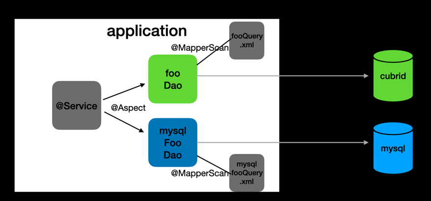

## 1. MySQL용 쿼리 검증
---

> MyBatis를 사용하고 있기 때문에, MySQL 운영을 위해서는 MySQL 쿼리 작성이 필수.

- 따라서 MySQL용 쿼리에 대한 쿼리 검증이 필수
- 검증 대상:
  - **쿼리 문법 에러**는 없는지
  - 읽기의 경우, Cubrid와 **동일한 결과값이 조회**되는지
  - 쓰기의 경우, Cubrid와 **동일하게 데이터 변경**이 발생했는지

## 구현 방식
---

### Spring AOP

### main db 설정

### 검증 배치

## 선택 이유
---

- 기존 코드의 변경없이 목적 달성 가능

## 한계점
---

- MySQL로의 완전 전환 전까지는 DAO, 쿼리를 두 벌로 관리해야한다.
  - 따라서, 전환까지의 기간이 길어지거나 일부 테이블만 먼저 MySQL로 전환하는 경우, 관리가 번거로울 수 있음.
- 조회 쿼리 => get, find, select로 구분, 예외케이스 있으면 제대로 처리안될 수 있음
- 요청이 없어서 실행안되는 쿼리 있을 수 있음
=> dao 테스트코드

- 스키마 변경 계속 추적관리해야됨 (? 이관전 마지막 상태 반영히면 편하려나 ?)
- read/write 설정 변경 실시간 반영은 어려움

**1. MYSQL 쿼리 검증**
- `mybatis`를 사용중이었기 때문에, mysql용 쿼리 작성이 필요
- 따라서, MYSQL 전환되기 전에 해당 쿼리들이 에러는 없는지, 쿼리 에러가 없더라도 데이터가 cubrid와 동일한 값으로 변경되고 조회되는지를 어떻게 검증할지
  - 이 부분은 dao cubrid로 CRUD할 때, Spring AOP를 활용하여 intercept
  - mysql 쪽에도 동일하게 CRUD 하면서 쿼리 에러가 발생하거나, cubird 쪽과 select 결과가 다르면 개발자에게 알림 (비동기로 처리)
- 데이터 변경은 되었지만 쿼리로 SELECT 되지 않는 데이터들이 있을 수도 있기 때문에, 이런 부분들까지 커버하기 위해 별도의 데이터 검증 배치 구현

**1-1. 부하테스트**
- 피크 시간대의 TPS(20~30) 파악하여 JMeter 사용해서 1초에 약 30개의 요청을 5분간 (csv 파일 세팅해서)
- 이중화 구조 적용 안한 버전 vs 이중화 구조시 cubrid read vs mysql read
- CPU, 메모리, 응답시간 위주로 확인 (MethodInvoker 사용으로 인한 성능 저하있을지 우려)

## 다른 상황 가정
---

- 모든 테이블이 한 번에 마이그하기 어렵다면 ?
- ㅇㅇ
- JPA 사용했다면 ? (JPA로 전환 ?) => 쿼리 작성 불필요
