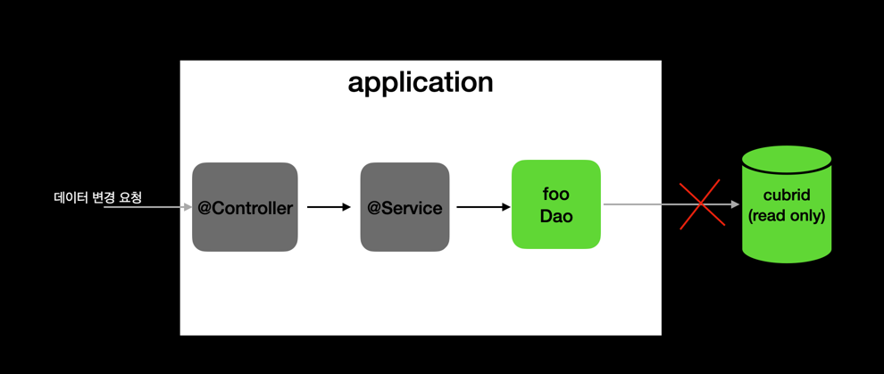
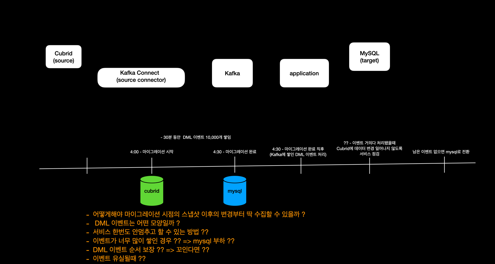

## 2. Cubrid에서 MySQL로 데이터 마이그레이션
---

> 마이그레이션되는 동안 데이터 변경이 없도록 하기 위해, 서비스는 Read Only만 가능하게

- 사용자 요청이 가장 적은 새벽 시간대에 진행
- Read Only로 운영되는 시간을 최소화하기 위해, 마이그레이션에 걸리는 시간을 최소화 하는 방향을 생각

## 작업 방식
---

- 마이그레이션 작업일시를 10/2 4:00 이라고 한다면, 10/1 23:59까지 쌓인 데이터들에 대해 변경이 없는 테이블(이력, 특정 시간에만 변경 일어나는 데이블 등)에 대해 10/1 23:59까지 쌓인 데이터 미리 마이그레이션해서 4:00에 마이그레이션해야할 전체 데이터 건수 줄이기

- 4:00부터 데이터 마이그레이션 완료될때까지 서비스 read only

## 선택 이유
---

- 마이그레이션 되는동안 데이터 변경이 없기 때문에, 애플리케이션에서 크게 신경쓸 부분이 없음
- 해당 서비스의 경우, 20 ~ 25분 정도 다운 타임이 있는건 서비스 운영에 큰 지장이 없었음

## 한계점
---

- DB 변경만 막는거기 때문에, DB 처리 안됐는데, API 호출만 처리된다거나 하는 로직은 구멍이 생길 수 있음
- 데이터가 훨씬 더 많고, 서비스 점검 시간을 오래걸 수 없는 경우 이런 방식은 불가능

## 다른 방식 ?
---

- 모든 요청을 막을거면 인터셉터에서 처리하면 될듯
- 서비스 중단없이 가려면 ?
  - CDC
  - TransactionalEventListener ?

### CDC (Change-Data-Capture)
> Kafka Connect에 Cubrid용 커넥터 플러그인은 없긴함

- DB는 특정 시점시각의 스냅샷 기준으로 마이그레이션됨

어떻게해야 마이그레이션 시점의 스냅샷 이후의 변경부터 딱 수집할 수 있을까 ?
DML 이벤트는 어떤 모양일까 ?
서비스 한번도 안멈추고 할 수 있는 방법 ??
이벤트가 너무 많이 쌓인 경우 ?? => mysql 부하 ??
DML 이벤트 순서 보장 ?? => 꼬인다면 ??
이벤트 유실될때 ??

