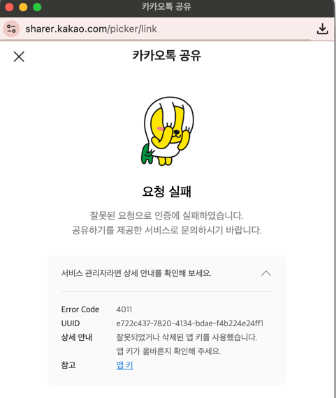
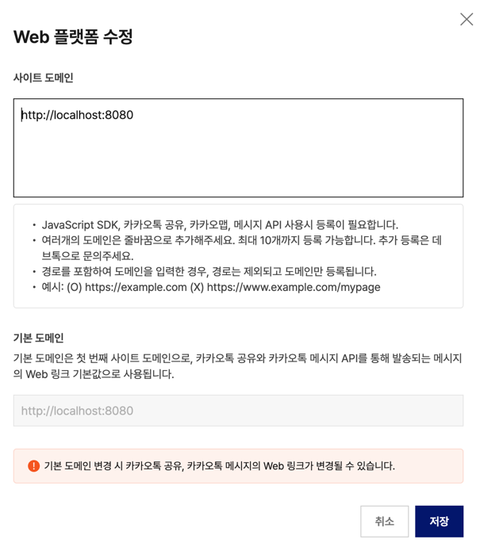

## 카카오톡 공유 연동
https://developers.kakao.com/docs/latest/ko/kakaotalk-share/faq

카카오톡 공유 API는 앱의 플랫폼 설정에 등록된 도메인에서만 정상 동작합니다. 이용 시 웹, Android, iOS 중 서비스에서 사용 중인 플랫폼을 반드시 등록해야 하며, 사이트 주소 변경 시 바뀐 도메인을 플랫폼 정보에 추가해야 합니다. 메시지에 포함된 버튼과 링크는 앱 설정을 바탕으로 설정되며, 등록되지 않은 도메인 주소는 메시지 링크에 사용할 수 없습니다.

https://developers.kakao.com/docs/latest/ko/app-setting/app#platform

Web
도메인 등록 화면
🅐 사이트 도메인

Kakao SDK for JavaScript, 카카오톡 공유, 카카오톡 메시지 API 사용 시 필요
http://, https://, file:// 형식의 도메인 등록
http와 https 도메인은 둘 중 한 가지만 등록해도 사용 가능
최대 10개의 도메인 등록 가능
11개 이상의 도메인 등록이 필요한 경우, 비즈 앱 전환 후 와일드카드 문자를 포함한 서브 도메인을 사용하거나 별도 문의 (참고: 사이트 도메인 등록 수 제한 및 도메인 추가 등록 안내)
🅑 기본 도메인

하나 이상의 도메인 등록 시, 맨 윗줄에 등록된 도메인을 기본 도메인으로 설정
기본 도메인은 카카오톡 공유, 카카오톡 메시지 API로 발송하는 메시지의 링크 중 [Web] 기본값으로 사용

### github에 코드 공유한다고하면 앱키는 코드에서 어떻게 숨기지 ?

## https 처리
