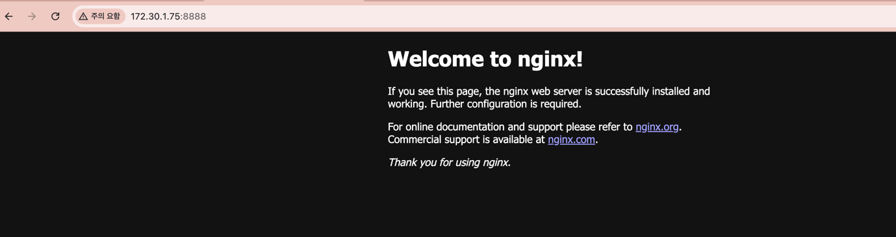
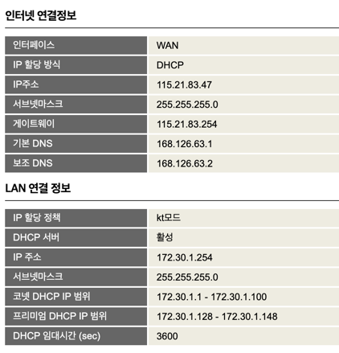
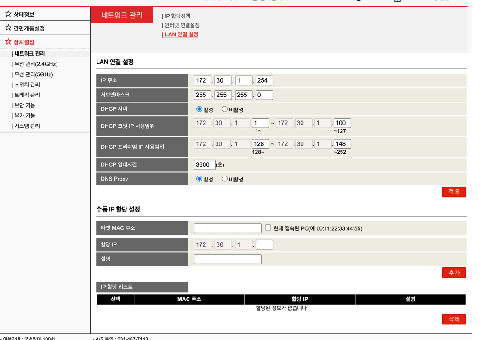
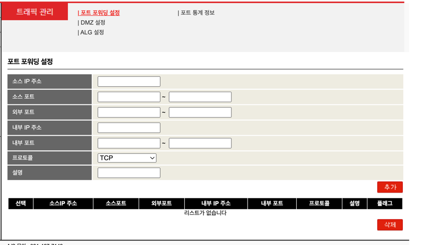
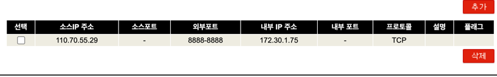
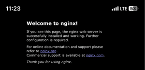

놀고있는 윈도우 노트북으로 서버를 만들어보자.

동일한 와이파이로 연결된 맥북에서 윈도우 노트북의 ipconfig해서 나오는 무선 LAN 어댑터 Wi-Fi: 의 IPv4 주소:포트번호 하니까 접속 잘되네 ??

윈도우 : 172.30.1.75
맥북 : 172.30.1.58
스마트폰 : 172.30.1.29

=> 172.30.1 이 같고 접속 잘되네 ??

스마트폰 와이파이 끄니까 안되네 ??

## 왜 되지 ?
- **같은 서브넷(예: 172.30.1.x)**에 있는 기기들은 **라우터 없이도 직접 통신 가능**하기 때문에 포트만 열려 있으면 바로 접속 가능합니다.
- 보통 공유기가 자동으로 설정한 서브넷 마스크가 `255.255.255.0`이기 때문이에요. 즉, `172.30.1.0 ~ 172.30.1.255`까지는 모두 같은 네트워크에 있다고 판단되며, 직접 통신이 가능합니다.
- 같은 서브넷에 있을 경우:
  - 공유기나 라우터를 거치지 않고 직접 통신이 가능합니다.
   → 맥북이 윈도우 IP를 알고 있다면 바로 패킷을 보냄.
- 이 때 사용되는 프로토콜은 주로 ARP(Address Resolution Protocol)
→ IP에 대응하는 MAC 주소를 찾아서 이더넷 프레임을 만들어 보냄.

## 서브넷 ? 서브넷 마스크 ?

| 용어          | 의미                                                   |
| ----------- | ---------------------------------------------------- |
| **서브넷**     | 네트워크를 나눈 논리적인 그룹. 같은 서브넷끼리는 직접 통신 가능                 |
| **서브넷 마스크** | IP 주소에서 어디까지가 네트워크(동네)이고 어디부터가 호스트(집)인지 정하는 값        |
| 예시          | `255.255.255.0`은 앞 3바이트(24비트)가 네트워크 구분용이라는 뜻 (`/24`) |

| 환경       | 서브넷 설정 위치                       |
| -------- | ------------------------------- |
| 가정용      | 공유기 관리자 페이지 (LAN 설정, DHCP 설정 등) |
| 기업/학교    | 라우터, L3 스위치, DHCP 서버            |
| 클라우드     | VPC/Subnet 설정 페이지               |
| 로컬 수동 설정 | 리눅스 `ip`, 윈도우 네트워크 설정           |

## DHCP (Dynamic Host Configuration Protocol)
> 자동으로 IP 주소를 할당해주는 프로토콜

**DHCP가 해주는 일**
> 아래 항목들을 자동으로 클라이언트(노트북, 스마트폰 등)에 알려줘요.

- IP 주소 부여
- 서브넷 마스크
- 기본 게이트웨이 (라우터 주소)
- DNS 서버 주소
- 임대 기간 (IP 주소를 얼마나 쓸지)

**DORA**
> 기기가 처음 네트워크에 연결될 때 DORA 과정을 거침

**D**iscover
- 클라이언트가 브로드캐스트로 “누가 DHCP 서버 있나요?”라고 물어봄

**O**ffer
- DHCP 서버(ex : 공유기)가 “나 여기 있고, 이 IP 써봐” 하고 제안함

**R**equest
- 클라이언트가 “그 IP 쓸게요” 하고 요청함

**A**ck (Acknowledgment)
- 서버가 “좋아, 이 IP 너한테 줄게” 하고 확정함

**DHCP 서버는 어디 있나요?**

| 환경      | DHCP 서버 위치                       |
| ------- | -------------------------------- |
| 가정용     | 대부분 공유기 안에 포함                    |
| 기업 네트워크 | 윈도우 서버, 리눅스 DHCP 서버 등            |
| 클라우드    | AWS, GCP 등도 자동으로 IP 부여 (VPC 내에서) |

**와이파이 연결 시 서브넷 할당 과정**

1. 노트북/스마트폰은 처음엔 IP가 없음
- Wi-Fi 비밀번호 입력 후 AP(공유기)와 연결이 완료되면,
- “나 네트워크 주소(IP)가 없네? DHCP 서버에게 물어봐야지” 상태가 됩니다.

2. DHCP 요청 (DISCOVER)
- 클라이언트가 브로드캐스트 패킷(255.255.255.255)을 보내며,
- **“이 네트워크에서 쓸 수 있는 IP랑 서브넷 마스크 좀 주세요”**라고 요청.

3. 공유기가 서브넷 정보를 같이 줌 (OFFER/ACK)
- 공유기(=DHCP 서버)는 다음 정보를 함께 클라이언트에 전송:
  - IP 주소 (예: 172.30.1.58)
  - 서브넷 마스크 (예: 255.255.255.0)
  - 기본 게이트웨이 (예: 172.30.1.1 – 공유기 주소)
  - DNS 서버 주소
- 즉, 서브넷은 공유기의 LAN 설정에서 이미 정해진 값을 그대로 내려줍니다.

4. 클라이언트가 서브넷 정보를 적용
- 받은 IP, 서브넷 마스크를 OS의 네트워크 인터페이스에 설정합니다.
- 이제 해당 서브넷 안의 다른 기기들과 바로 통신 가능.
- 그렇다면 서브넷은 누가 결정할까?
  - 공유기의 LAN 설정에서 서브넷이 미리 정의되어 있어요.
    - 예: 공유기 LAN IP: 172.30.1.1
       - 서브넷 마스크: 255.255.255.0
       - DHCP 할당 범위: 172.30.1.2 ~ 172.30.1.254
       → 모든 클라이언트는 이 서브넷 안에서만 주소를 받게 됩니다.

- 서브넷 변경하고 싶다면?
   - 공유기 관리자 페이지에서: LAN 설정 → 서브넷 마스크/게이트웨이 변경
  - 예를 들어 /24 (255.255.255.0)을 /23 (255.255.254.0)으로 바꾸면 IP 대역폭이 512개로 증가

**※ 클라이언트가 브로드캐스트로 “누가 DHCP 서버 있나요?”라고 물어봄 ??**
  => IP 할당받기 전엔 아직 서브넷을 모를텐데 어떻게 가능한거지 ?

- 클라이언트는 서브넷이 뭔지 모르는 상태에서도, 모든 장치(=서브넷 내 모든 장치)를 대상으로 브로드캐스트를 보냅니다. 왜냐면... 서브넷을 몰라도 브로드캐스트는 할 수 있게 설계돼 있기 때문

- 클라이언트의 네트워크 상태 초기:
  - IP 주소: 없음 (0.0.0.0)
  - 서브넷 마스크: 없음
  - 게이트웨이: 없음
- 그럼에도 불구하고
  - DHCP DISCOVER 메시지는 255.255.255.255 브로드캐스트 주소로 전송
  - 이 주소는 “모든 호스트에게 보내라”는 예약 주소입니다
  - 즉, 클라이언트는 서브넷이 뭔지 몰라도,
  - **“일단 여기 있는 모든 장비들아, DHCP 서버 있으면 응답해줘”**라고 할 수 있는 거죠

- DHCP DISCOVER는 Layer 2 브로드캐스트이기 때문에,  같은 스위치, 같은 공유기, 같은 Wi-Fi SSID에 연결된 장비들에게만 도달합니다.
  - 이 영역을 **브로드캐스트 도메인**이라고 부릅니다.

| 계층               | 설명                       |
| ---------------- | ------------------------ |
| **2계층 (데이터 링크)** | MAC 주소로 통신, IP 몰라도 통신 가능 |
| **3계층 (네트워크)**   | IP 주소 필요                 |

| 필드      | 값                         |
| ------- | ------------------------- |
| 출발지 IP  | `0.0.0.0`                 |
| 목적지 IP  | `255.255.255.255`         |
| 출발지 MAC | 클라이언트의 실제 MAC 주소          |
| 목적지 MAC | `FF:FF:FF:FF:FF:FF`       |
| 포트      | 클라이언트: UDP 68, 서버: UDP 67 |

**MAC 주소로 통신한다 ?**
> MAC 주소로 통신한다는 말은
네트워크에서 장비(컴퓨터, 스마트폰 등)를 식별할 때 IP가 아닌 MAC 주소를 기반으로 통신한다는 뜻이에요.
이건 주로 로컬 네트워크(같은 공유기에 연결된 기기들) 안에서 일어납니다.

인터넷을 사용할 때는 IP 주소로 통신하죠.
하지만 실제로 같은 네트워크(서브넷) 안에서 물리적인 통신은 MAC 주소로 이루어져요.

예시 흐름:
맥북이 172.30.1.75(윈도우)에 HTTP 요청을 보내려 함

"이 IP를 가진 장비의 MAC 주소가 뭐지?" → ARP 요청

윈도우가 응답: "내 MAC은 C4:04:15:2A:6F:9D야"

이제 맥북은 실제 패킷을 IP가 아니라 MAC 주소를 목적지로 하여 전송

| 계층               | 설명                  | 주소                  |
| ---------------- | ------------------- | ------------------- |
| 3계층 (네트워크)       | IP 주소 기반 라우팅        | `172.30.1.75`       |
| **2계층 (데이터 링크)** | **MAC 주소 기반 실제 전달** | `C4:04:15:2A:6F:9D` |

- 결국 패킷은 3계층(IP) 기준으로 목적지를 정하되, 전송은 2계층(MAC) 기준으로 수행되는 거예요.

## 공유기 들어가보기
> KT : 초기설정 ktuser / homehub

- 2.4GHz Home WLAN vs 5GHz Home WLAN

## LAN vs WAN

## 외부에서 접속하려면 ?
> 포트포워딩 설정 : [당신 집 공유기 (공인 IP)] → [내부 윈도우 노트북 172.30.1.75:8888]

=> 소스IP주소 : 스마트폰 주소  
=> `https://whatismyipaddress.com`로 확인

## https://whatismyipaddress.com 에서 보이는 IP는?
> 내 기기가 외부 인터넷에서 보이는 "공인 IP 주소(Public IP)"입니다.
 스마트폰이든 노트북이든, 이 사이트는 당신의 요청이 **어디서 왔는지 (출발지 IP)**를 보고 표시해주는 거예요.

- 공인 IP = 인터넷 전체에서 유일하게 사용되는 IP 주소
- 이 IP는 당신의 공유기 또는 이동통신사가 보유한 주소입니다.

**이 IP는 어떻게 할당되는 걸까?**
 -상황 1: 집에서 Wi-Fi로 접속 중
   - ISP (인터넷 서비스 제공자: KT, SK, LG 등)가 공유기에게 공인 IP 1개를 할당해줍니다.
  - 공유기는 NAT(Network Address Translation)로 내부 장치(노트북, 스마트폰 등)와 IP 하나를 공유합니다.
  - 외부에서 보면 공유기의 공인 IP 하나만 보입니다.

- 상황 2: 스마트폰에서 LTE/5G로 접속 중
  - 이동통신사(SK, KT, LG)가 기지국을 통해 공인 IP 하나를 임시로 부여합니다.
  - **이 IP는 자주 바뀔 수 있으며**, NAT나 CGNAT(공유 공인 IP 기술)가 개입되기도 합니다.

| 구분                  | 설명                                         |
| ------------------- | ------------------------------------------ |
| **동적 IP (Dynamic)** | 대부분의 가정, 휴대폰: 재부팅하거나 일정 시간 지나면 IP가 바뀔 수 있음 |
| **고정 IP (Static)**  | 비용을 내고 신청하면, 항상 같은 IP 유지 가능 (서버 운영 등에 필요)  |

**공인 IP와 DHCP**
> 공유기가 공인 IP 할당받는 예시

- 공유기가 켜짐
- 공유기 WAN 포트는 ISP 모뎀이나 광선로 ONU에 연결됨
- 공유기가 DHCP DISCOVER 패킷을 브로드캐스트로 보냄
- ISP의 DHCP 서버가 응답:
→ “너는 공인 IP 203.0.113.25, 서브넷 마스크, 게이트웨이, DNS 써!”
- 공유기 WAN 인터페이스가 이 IP를 받아서 인터넷 접속 가능해짐

| 항목          | 설명                                |
| ----------- | --------------------------------- |
| WAN 연결 방식   | `DHCP` / `고정 IP` / `PPPoE`        |
| 현재 공인 IP 주소 | `203.0.113.x` 같은 주소               |
| 서브넷 마스크     | `255.255.255.0` 등                 |
| 게이트웨이       | ISP 라우터 주소                        |
| DNS 서버      | 168.126.63.1 등 (KT, Google DNS 등) |

**공유기 공인 IP에 도메인 맵핑해서 사용하는데 IP가 바뀌면 ?**

일반 가정 인터넷은 공인 IP가 재부팅/시간 경과 시 변경되기 때문에,
DNS A 레코드가 오래된 IP를 가리키게 되어 접속 불가 문제가 생깁니다.

이걸 해결하려면:

🟡 방법 1: 고정 IP 신청 (유료)
ISP(KT, SK, LG 등)에서 고정 공인 IP를 유료로 신청하면 항상 같은 IP 유지됨

🟢 방법 2: DDNS(Dynamic DNS) 연동
DDNS는 IP가 바뀔 때 자동으로 DNS 레코드를 갱신해주는 시스템

ipTIME 공유기, Cloudflare API, DuckDNS 등 무료/유료 서비스 많음

🛠 도메인에 Cloudflare DNS 사용하고 → 윈도우에 갱신 스크립트 설치하면 완전 자동화 가능

**NAT ?**

| 구분    | IP                                | 설명                       |
| ----- | --------------------------------- | ------------------------ |
| 공인 IP | 203.0.113.25                      | ISP가 할당해주는, 인터넷에 노출되는 IP |
| 사설 IP | 192.168.x.x, 172.16.x.x, 10.x.x.x | 내부 네트워크용. 공유기 내부에서만 유효   |

- 공유기는 사설 IP를 쓰는 내부 장치들의 요청을 하나의 공인 IP로 번역해서 인터넷에 보내주는 역할을 합니다.

**그럼 동일한 공유기 사용하는 a,b 단말기에서 같은 웹사이트에 접속하면 웹사이트 서버 입장에서는 동일한 ip로 보일텐데, 공유기는 서버에서 온 응답을 각각 a,b 단말기에 어떻게 전달해줘 ?**

> : 공유기가 "포트 번호"를 이용해서 구분
이 기술을 PAT (Port Address Translation) 또는 NAT Overload라고 부릅니다.

 | A의 요청                   | B의 요청                   |
| ----------------------- | ----------------------- |
| 출발지 IP: `192.168.0.10`  | 출발지 IP: `192.168.0.11`  |
| 출발지 포트: `54321`         | 출발지 포트: `54322`         |
| 목적지 IP: `93.184.216.34` | 목적지 IP: `93.184.216.34` |
| 목적지 포트: `443`           | 목적지 포트: `443`           |

| 원래                               | NAT 변환 후             |
| -------------------------------- | -------------------- |
| A → 출발지 IP: `192.168.0.10:54321` | `203.0.113.25:30001` |
| B → 출발지 IP: `192.168.0.11:54322` | `203.0.113.25:30002` |

공유기는 자신이 기억해둔 NAT 테이블을 보고 다음과 같이 처리합니다:

| 외부 포트   | 내부 목적지                        |
| ------- | ----------------------------- |
| `30001` | `192.168.0.10:54321` (A에게 전달) |
| `30002` | `192.168.0.11:54322` (B에게 전달) |

- 포트번호가 같더라도 문제없음

| 내부 기기              | 출발지 포트 | 변환된 공인 포트 (PAT) |
| ------------------ | ------ | --------------- |
| A (`192.168.0.10`) | 54321  | `30001`         |
| B (`192.168.0.11`) | 54321  | `30002`         |

| 외부 포트 | 내부 주소              |
| ----- | ------------------ |
| 30001 | 192.168.0.10:54321 |
| 30002 | 192.168.0.11:54321 |

실제 인터넷 접속은 **(출발지 IP, 출발지 포트, 목적지 IP, 목적지 포트)** 네트워크 정보로 구분됨

====

## 정리
- 동일한 공유기 사용하는 경우, 각 단말기는 공유기에서 할당하는 서브넷 주소를 받게됨
  - 같은 서브넷 내에서는 ARP을 통해 IP -> MAC 주소 변환해서 바로 접근 가능
  - 공유기의 와이파이 연결시 단말기가 IP를 할당 받으려면, DHCP 서버를 찾기위한 브로드캐스트 요청을 보내는데, 아직 IP가 없으므로 MAC 주소 기반으로 요청
  - 같은 브로드캐스트 도메인을 갖는(일반적으로 같은 공유기나 스위치 하위) 장비들에게만 도달됨

- 동일한 서브넷이 아닌 네트워크에서 접근하려면, 공유기의 공인 IP 파악 및 포트포워딩 설정 필요
- 공유기의 공인 IP는 인터넷 서비스 제공업체(ISP)의 DHCP 서버를 통해 동적으로 할당받을 수 있음
